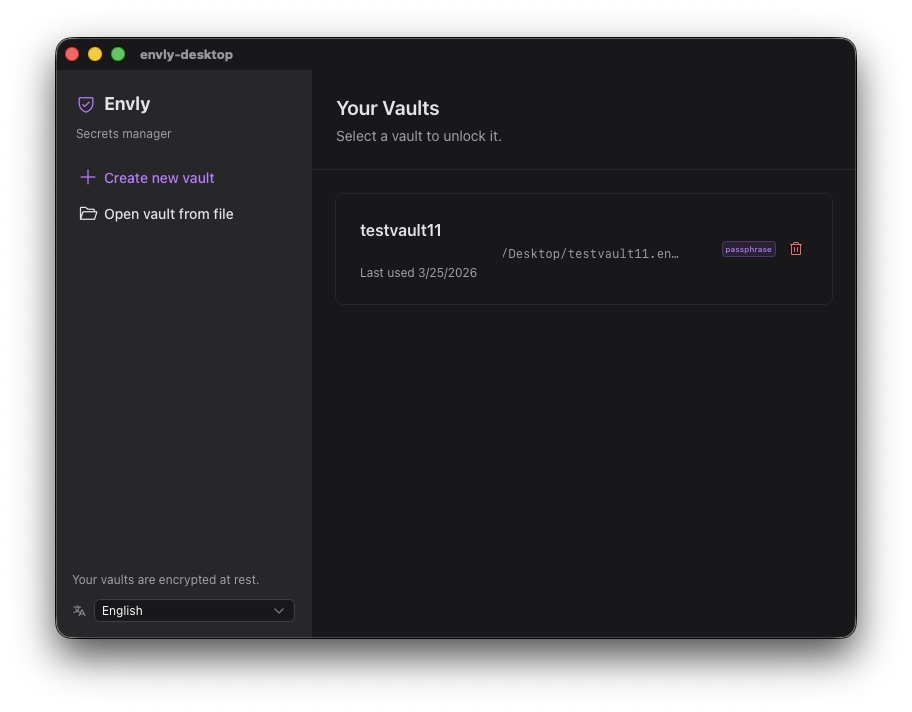

<a name="readme-top"></a>
<!-- Head section -->
<div align="center">
  <h1 align="center">Envly</h1>

  

  <p align="center">
    A desktop secrets and environment variable manager built with Tauri 2, Rust, and Nuxt 4.
    <br />
    Centrally manage secrets, organize them across projects and environments, and safely inject them into your local development workflow.
  </p>
</div>

<!-- Table of contents -->
<details>
  <summary>Table of Contents</summary>
  <ol>
    <li>
      <a href="#about-the-project">About The Project</a>
      <ul>
        <li><a href="#features">Features</a></li>
        <li><a href="#built-with">Built With</a></li>
      </ul>
    </li>
    <li>
      <a href="#getting-started">Getting Started</a>
      <ul>
        <li><a href="#prerequisites">Prerequisites</a></li>
        <li><a href="#installation">Installation</a></li>
      </ul>
    </li>
    <li><a href="#development">Development</a></li>
    <li><a href="#production">Production</a></li>
    <li><a href="#monorepo-structure">Monorepo Structure</a></li>
    <li><a href="#how-it-works">How It Works</a></li>
    <li><a href="#security">Security</a></li>
    <li><a href="#documentation">Documentation</a></li>
    <li><a href="#license">License</a></li>
  </ol>
</details>

<!-- About the project section -->
## About The Project

Developers juggle `.env` files across dozens of repositories. Secrets get copy-pasted, committed by accident, and fall out of sync between staging and production. Envly solves this by providing encrypted vaults for all your secrets, with per-project, per-environment mappings that are resolved on demand and never written permanently into your source tree.

Envly uses a symlink-based approach — when you activate an environment, secrets are resolved into a secure temp file and a symlink is placed in your project directory. Your dev server reads it like a normal `.env` file, but if the symlink is ever committed to git, it just points to a non-existent path. No secrets are leaked.

<p align="right">(<a href="#readme-top">back to top</a>)</p>

<!-- Features section -->
### Features

- 🔐 **Encrypted Vaults** — All secrets encrypted at rest with XChaCha20-Poly1305 (passphrase via Argon2id or OS keychain)
- 🔗 **Symlink Injection** — Secrets injected via symlinks, never written as plaintext into your project tree
- 📁 **Multi-Vault Support** — Create, import, export, and switch between multiple independent vaults
- 🗂️ **Projects & Environments** — Organize secrets by project and environment (dev, staging, production)
- 🏷️ **Tags & Search** — Tag secrets for organization and filter them instantly
- ⏰ **Expiration Dates** — Set expiry on secrets with UI warnings to encourage rotation
- 🌍 **Internationalization** — English, Spanish, and Italian language support
- 🌙 **Light & Dark Mode** — System-aware theme toggle
- 🖥️ **Cross-Platform** — macOS (ARM64 & Intel), Windows, and Linux

<p align="right">(<a href="#readme-top">back to top</a>)</p>

<!-- Built with section -->
### Built With

- 
- 
- 
- 
- 
- 

**Backend (Rust):**
- **Tauri 2** — Application framework, IPC, window management
- **XChaCha20-Poly1305** — AEAD encryption for vault files
- **Argon2id** — Key derivation from user passphrase
- **Keyring** — Cross-platform OS keychain access (macOS Keychain, Windows Credential Manager, Linux Secret Service)
- **Zeroize** — Secure memory wiping on drop

**Frontend (TypeScript / Vue):**
- **Nuxt 4** — Vue framework (SPA mode for Tauri)
- **Nuxt UI** — Component library (Tailwind CSS + Radix Vue)
- **Nuxt i18n** — Internationalization
- **Pinia** — State management

<p align="right">(<a href="#readme-top">back to top</a>)</p>

<!-- Getting Started section -->
## Getting Started

Follow these instructions to set up the project locally for development.

### Prerequisites

- [Rust](https://rustup.rs/) (stable toolchain)
- [Node.js](https://nodejs.org/) >= 18
- [pnpm](https://pnpm.io/) >= 10
- Platform-specific Tauri dependencies ([see Tauri docs](https://v2.tauri.app/start/prerequisites/))

### Installation

1. Clone the repository
```bash
git clone https://github.com/eiliv17/envly.git
cd envly
```

2. Install dependencies
```bash
pnpm install
```

<p align="right">(<a href="#readme-top">back to top</a>)</p>

<!-- Development section -->
## Development

Start the desktop app in development mode (launches both the Nuxt dev server and Tauri):

```bash
pnpm dev:desktop
```

Start the website/docs in development mode:

```bash
pnpm dev:website
```

Run linting and type checking across all packages:

```bash
pnpm lint
pnpm typecheck
```

<p align="right">(<a href="#readme-top">back to top</a>)</p>

<!-- Production section -->
## Production

Build the desktop app for production:

```bash
pnpm build:desktop
```

Build the website for production:

```bash
pnpm build:website
```

<p align="right">(<a href="#readme-top">back to top</a>)</p>

<!-- Monorepo structure section -->
## Monorepo Structure

This project uses a pnpm workspace monorepo:

```
envly/
├── packages/
│   ├── envly-desktop/        # Tauri + Nuxt 4 desktop app
│   │   ├── app/              # Nuxt frontend (pages, components, stores)
│   │   ├── i18n/             # Locale files (en, es, it)
│   │   └── src-tauri/        # Rust backend source
│   └── envly-website/        # Marketing site + documentation
│       ├── app/              # Nuxt frontend
│       └── content/          # Markdown documentation
├── docs/                     # Architecture, contributing, and release docs
├── pnpm-workspace.yaml
├── package.json              # Root scripts
└── README.md
```

<p align="right">(<a href="#readme-top">back to top</a>)</p>

<!-- How it works section -->
## How It Works

### Core Concepts

- **Secrets** — Globally defined key-value pairs stored in an encrypted vault. Support tags, descriptions, and expiration dates.
- **Vaults** — Independent encrypted files (XChaCha20-Poly1305) that can live anywhere on disk. Each vault contains all its secrets, projects, and environments.
- **Projects** — Map to a local repository or working directory. Each project has a configurable env filename (`.env`, `.env.local`, etc.).
- **Environments** — Per-project configurations (dev, staging, production) that map local env keys to global secrets. Only one environment per project can be active at a time.

### Symlink Mechanism

When you activate an environment, Envly:

1. Resolves all env mappings to their current secret values
2. Writes the resolved key-value pairs to a secure temp file (`0600` permissions)
3. Creates a symlink from your project directory to the temp file
4. Your dev server reads the symlink like a normal `.env` file

On deactivation (or app exit), the temp file and symlink are cleaned up. If a symlink is accidentally committed to git, it points to a non-existent path on any other machine — no secrets are leaked.

### Vault Lifecycle

1. **Uninitialized** — First launch, create a new vault with passphrase or keychain encryption
2. **Locked** — Vault file exists but is encrypted on disk
3. **Unlocked** — Vault decrypted in memory, all operations available

<p align="right">(<a href="#readme-top">back to top</a>)</p>

<!-- Security section -->
## Security

Envly takes security seriously:

- **Encryption at rest** — All vault data encrypted with XChaCha20-Poly1305 AEAD. Passphrase mode uses Argon2id KDF (64 MiB, 3 iterations, 4 parallelism per RFC 9106).
- **Memory safety** — Secret values use `Zeroizing<String>` and are wiped on drop. No `Debug`/`Display` on secret types to prevent accidental logging.
- **Minimal IPC exposure** — Secret values are masked in list responses; a separate `reveal_secret_value` command is required to access plaintext.
- **Secure temp files** — Stored in an app-owned directory (`0700`) with file permissions `0600`. Manifest tracking ensures cleanup on crash.
- **Atomic writes** — Vault writes use temp file + rename to prevent corruption. A `.bak` file is kept as crash safety.

For the full threat analysis, see [docs/architecture.md](docs/architecture.md).

<p align="right">(<a href="#readme-top">back to top</a>)</p>

<!-- Documentation section -->
## Documentation

- [Architecture](docs/architecture.md) — Detailed architecture, data model, security model, and threat analysis
- [Contributing](docs/CONTRIBUTING.md) — Contribution guidelines
- [Release Process](docs/RELEASE.md) — How releases are managed

<p align="right">(<a href="#readme-top">back to top</a>)</p>

<!-- License section -->
## License

Apache 2.0 — see [LICENSE](LICENSE) and [NOTICE](NOTICE).

<p align="right">(<a href="#readme-top">back to top</a>)</p>
