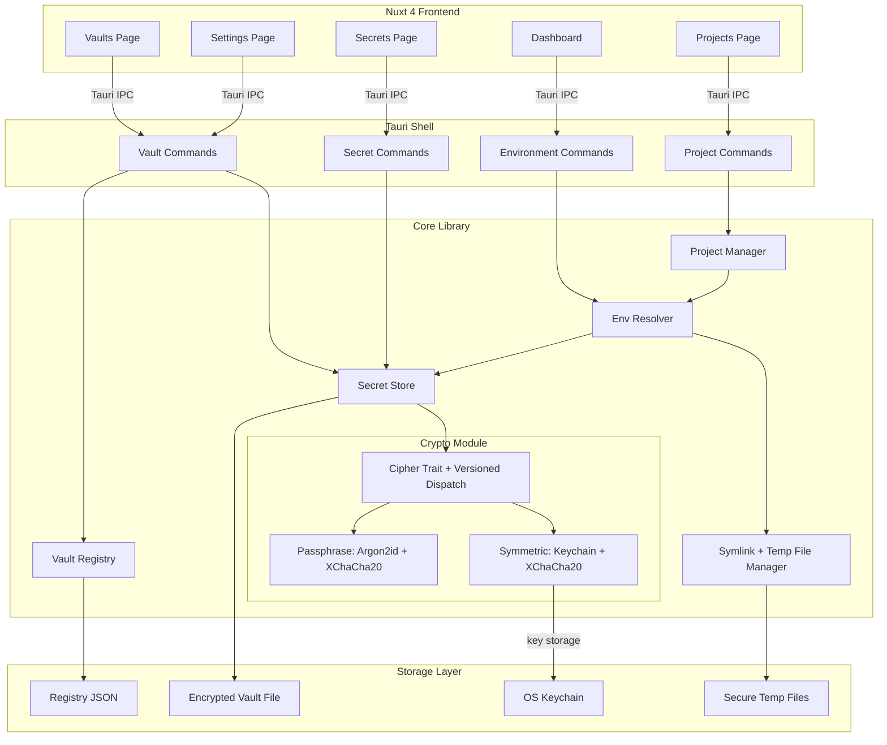
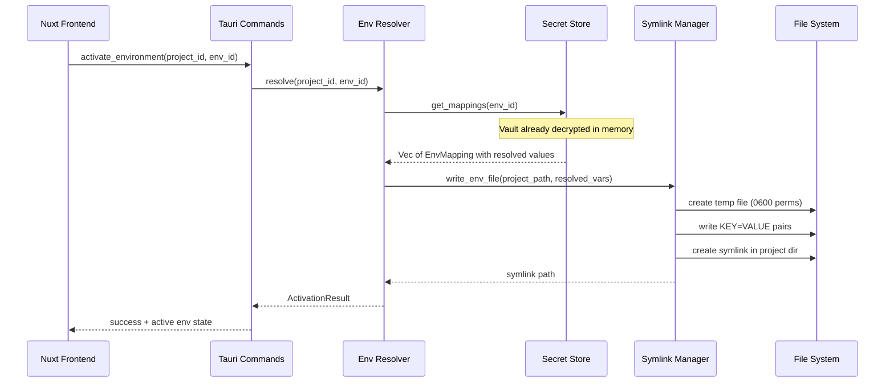
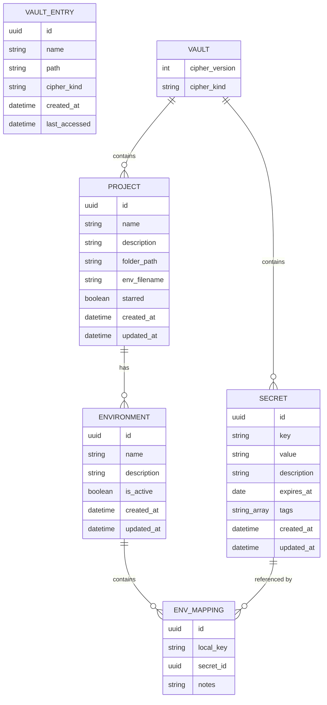

# Envly

A desktop secrets and environment variable manager built with Tauri 2, Rust, and Nuxt 4. Envly lets you centrally manage secrets, organize them across projects and environments, and safely inject them into your local development workflow using a symlink-based approach that prevents accidental git exposure.

## Motivation

Developers juggle `.env` files across dozens of repositories. Secrets get copy-pasted, committed by accident, and fall out of sync between staging and production. Envly solves this by providing encrypted vaults for all your secrets, with per-project, per-environment mappings that are resolved on demand and never written permanently into your source tree.

## Core Concepts

### Secrets

A **secret** is a globally defined key-value pair (e.g. `POSTGRES_PASSWORD_STAGING = "hunter2"`). Each secret can have:

- A human-readable **description**
- One or more **tags** for filtering and organization (e.g. `database`, `staging`, `aws`)
- An optional **expiration date** — when set, the UI shows warnings as the date approaches and alerts when expired, encouraging regular secret rotation

Secrets are stored in an encrypted vault file (XChaCha20-Poly1305 AEAD). The entire vault is decrypted into memory on unlock and stays locked at rest — secret values are only visible in the UI when explicitly revealed.

### Vaults

Envly supports **multiple vaults** through a vault registry. Each vault is an independent encrypted file that can be stored anywhere on disk. The vault registry (`registry.json`) tracks all known vaults and remembers which one was last active.

Users can:

- Create new vaults with a custom name, file path, and cipher mode
- Import existing vault files from disk
- Export encrypted copies of a vault (with a separate passphrase) for sharing or backup
- Rename or delete vaults
- Switch between vaults at any time — switching locks the current vault and selects the new one

### Projects

A **project** maps to a single repository or working directory on disk. Each project has:

- **Name** and **description**
- **Folder path** pointing to the local checkout
- **Env filename** — the name of the file to write/symlink in the project directory (defaults to `.env`, but configurable to `.env.local`, `.env.development`, etc. to match the framework's convention)
- **Starred** flag for quick access on the dashboard

The folder path is validated every time the app starts or the project is loaded. If the path no longer exists, the project is flagged with a warning so you know it needs attention.

Deleting a secret that is still referenced by env mappings is prevented — the UI shows which environments depend on it so you can clean up the references first.

### Environments

Each project can have an arbitrary number of **environments** (e.g. `development`, `staging`, `production`, `test`). An environment defines:

- **Name** and **description**
- A set of **env mappings** — each mapping binds a project-local key (like `DATABASE_URL`) to a global secret, with an optional **note** explaining why this particular mapping exists or how it differs from other environments

Only **one environment per project** can be active at a time — since they all write to the same env filename in the project directory. Activating a new environment automatically deactivates the current one. When an environment is **activated**, its mappings are resolved into a concrete `.env`-style file and made available in the project directory via a symlink.

### Vault Lifecycle

The vault has three states:

1. **Uninitialized** — first launch, no vault file exists. The user is guided through setup: choose a cipher mode (passphrase or keychain) and create the vault.
2. **Locked** — vault file exists on disk but is not decrypted. The user must authenticate (enter passphrase or the OS keychain unlocks automatically) to proceed.
3. **Unlocked** — vault is decrypted and held in memory as Tauri managed state (behind a `RwLock`). All reads and writes go through this in-memory state.

When the vault locks (via explicit user action or app exit), the in-memory state is dropped (and zeroized), all active temp files and symlinks are cleaned up, and the user must re-authenticate to continue.

**Passphrase change**: The user can change their master password from Settings. The flow is: decrypt the vault with the current cipher, re-encrypt with the new passphrase, and atomically write the new vault file.

**Cipher migration** (planned): Switching between passphrase and keychain mode from Settings will be supported in a future release.

## How the Symlink Mechanism Works

```
┌──────────────────────────────────────────────────────────────┐
│  1. User activates environment "staging" on project "api"    │
│                                                              │
│  2. Envly resolves all env mappings:                         │
│       DATABASE_URL  ->  Secret#12 (decrypted)                │
│       REDIS_HOST    ->  Secret#7  (decrypted)                │
│                                                              │
│  3. Writes resolved key=value pairs to a secure temp file:   │
│       ~/.local/share/envly/tmp/env-<uuid>                    │
│       (permissions: 0600, owner-only)                        │
│                                                              │
│  4. Creates a symlink in the project directory:              │
│       /home/user/code/api/.env  -->  ~/.../tmp/env-<uuid>    │
│                                                              │
│  5. Dev server reads .env as usual — it follows the symlink  │
│                                                              │
│  6. On deactivation or app exit:                             │
│       - Temp file is securely deleted                        │
│       - Symlink is removed                                   │
│                                                              │
│  If the symlink is accidentally committed to git:            │
│       - On any other machine it points to a non-existent     │
│         path, so no secrets are leaked                       │
└──────────────────────────────────────────────────────────────┘
```

Envly uses symlinks exclusively. Symlinks are safer than writing plaintext `.env` files directly into the project tree — if accidentally committed, they are just broken links pointing to a non-existent path, leaking no secret data. The user is responsible for adding the env filename (e.g. `.env`) to their project's `.gitignore`.

### Platform Note: Windows Symlinks

On Windows, creating symlinks requires either **Administrator privileges** or **Developer Mode** to be enabled. Envly checks for symlink capability at startup and warns the user if it is unavailable, with instructions on how to enable Developer Mode.

### Existing File Collision

When activating an environment, the target file (e.g. `.env`) may already exist in the project directory as a regular file (not managed by Envly). Envly handles this by:
1. Detecting whether the existing file is a symlink managed by Envly, a symlink pointing elsewhere, or a regular file.
2. If it's a regular file, **backing it up** to `<filename>.bak` (e.g. `.env.bak`) before replacing it, and showing a notification in the UI with the backup path.
3. If it's an unrecognized symlink, refusing to overwrite and prompting the user to resolve the conflict manually.

## Architecture

### High-Level Component Diagram



### Data Flow: Activating an Environment



### Data Model

Envly manages two types of persistent data:

1. **Vault Registry** (`registry.json`) — an unencrypted JSON file listing all known vaults (name, path, cipher kind, timestamps). Stored in the Tauri app data directory.
2. **Vault Files** (`*.envly`) — individually encrypted files that can live anywhere on disk. Each contains all secrets, projects, environments, and mappings for that vault.

Vault file locations are user-chosen. The registry tracks their paths:

| Platform | Registry path |
|---|---|
| macOS | `~/Library/Application Support/com.envly.envly/registry.json` |
| Linux | `~/.local/share/com.envly.envly/registry.json` |
| Windows | `%APPDATA%\com.envly.envly\registry.json` |

On unlock, the entire vault file is decrypted and deserialized into in-memory Rust structs. On any mutation, the full state is re-serialized, encrypted, and atomically written back (write to temp file, then rename). Before each write, the previous vault file is copied to a `.bak` file as a crash-safety mechanism; the backup is removed after a successful write.



Tags are stored as a `Vec<String>` directly on each secret rather than as a separate normalized entity — simpler to manage and perfectly adequate at this scale. Relations between env mappings and secrets are resolved in memory via `HashMap<Uuid, Secret>` lookups.

### Rust Backend Module Structure

The backend is split into two layers: a **core library** containing all business logic, crypto, and storage — and a **thin Tauri shell** that exposes the core as IPC commands. This separation keeps the core testable in isolation and opens the door to a future CLI companion.

```
src-tauri/src/
├── main.rs                     # Entry point
├── lib.rs                      # Tauri builder, command registration
├── state.rs                    # Tauri managed state: vault behind RwLock, dirty-flag save loop
├── commands/                   # Thin Tauri command layer (IPC boundary)
│   ├── mod.rs
│   ├── vault_commands.rs       # Multi-vault registry, vault lifecycle, import/export
│   ├── secrets.rs              # CRUD for secrets and tags
│   ├── projects.rs             # CRUD for projects, path validation, starring
│   └── environments.rs         # CRUD for environments, activation/deactivation, mappings
│
├── core/                       # Standalone core — no Tauri dependency
│   ├── mod.rs
│   ├── registry.rs             # VaultRegistry: load/save, add/remove/rename vault entries
│   ├── vault/
│   │   ├── mod.rs              # Load, save, lock/unlock lifecycle
│   │   └── models.rs           # Vault, Secret, Project, Environment, EnvMapping structs
│   ├── crypto/
│   │   ├── mod.rs              # Cipher trait, CipherKind enum, versioned dispatch
│   │   ├── keychain.rs         # OS keychain integration (store/retrieve master key)
│   │   ├── passphrase.rs       # Argon2id KDF + XChaCha20-Poly1305 (user password)
│   │   └── symmetric.rs        # XChaCha20-Poly1305 with keychain-stored 256-bit key
│   ├── env/
│   │   ├── mod.rs
│   │   ├── resolver.rs         # Resolve env mappings to concrete values
│   │   └── symlink.rs          # Temp file + symlink lifecycle, manifest tracking
│   └── error.rs                # Unified error types
│
└── error.rs                    # Tauri-specific error conversions
```

### Nuxt Frontend Structure

The frontend uses Nuxt 4 with file-based routing, `@nuxt/ui` for the component library, and `@nuxtjs/i18n` for internationalization (English, Spanish, Italian).

```
app/
├── app.vue                     # Root shell: UApp + NuxtLayout + NuxtPage
├── app.config.ts               # Nuxt UI theme (primary: purple, neutral: zinc)
├── assets/
│   └── css/main.css            # Tailwind + Nuxt UI imports
├── layouts/
│   ├── auth.vue                # Minimal layout for vault selection, setup, unlock
│   └── default.vue             # Main app layout with nav, theme toggle, vault dropdown
├── middleware/
│   └── vault-guard.global.ts   # Global route guard: redirects based on vault state
├── pages/
│   ├── index.vue               # Entry redirect (to /vaults, /unlock, or /dashboard)
│   ├── vaults.vue              # Vault list: create, import, select, delete
│   ├── setup.vue               # New vault creation wizard
│   ├── unlock.vue              # Vault unlock (passphrase or keychain)
│   ├── dashboard.vue           # Project overview with per-project env activation
│   ├── secrets.vue             # Global secrets management (search, reveal, CRUD)
│   ├── settings.vue            # Vault rename, change passphrase, export, language, delete
│   └── projects/
│       ├── index.vue           # Project list and CRUD
│       └── [id].vue            # Project detail: environments, mappings
├── components/
│   ├── VaultCard.vue           # Vault card (name, path, cipher badge, last accessed)
│   ├── SecretFormModal.vue     # Create/edit secret modal
│   ├── ProjectFormModal.vue    # Create/edit project modal (with folder picker)
│   └── EnvironmentFormModal.vue # Create/edit environment modal
└── composables/
    └── useTauri.ts             # Typed wrappers around invoke() for all Tauri commands
```

## Security Model

### Threat Analysis

#### 1. Plaintext secrets on disk (temp files)

**Risk**: Temp files contain decrypted secrets. If placed in a world-readable directory like `/tmp`, any local user or process can read them.

**Mitigations**:
- Store temp files in an app-owned directory under the Tauri app data path with directory permissions `0700`:
  - macOS: `~/Library/Application Support/com.envly.envly/tmp/`
  - Linux: `~/.local/share/com.envly.envly/tmp/`
  - Windows: `%APPDATA%\com.envly.envly\tmp\`
- Create files with permissions `0600` (owner read/write only).

#### 2. Crash / unclean shutdown

**Risk**: If the app exits abnormally, temp files and symlinks remain on disk with plaintext secrets.

**Mitigations**:
- Maintain a manifest file (`active_envs.json`) tracking all currently active temp files and their PIDs.
- On startup, scan the manifest: if the PID is no longer running, delete the stale temp file and its symlink.
- On clean exit, Tauri's `RunEvent::ExitRequested` / `RunEvent::Exit` handlers lock the vault and clean up all temp files and symlinks.
- Set a conservative file TTL — temp files older than 24 hours are automatically purged.

#### 3. Symlink race attacks (TOCTOU)

**Risk**: A local attacker could replace the symlink target between creation and the consuming process reading it.

**Mitigations**:
- Use cryptographically random UUIDs in temp file names to make paths unpredictable.
- Verify symlink target ownership and permissions before activation is reported as successful.
- The temp directory itself has `0700` permissions, preventing other users from listing or manipulating its contents.

#### 4. Git exposure

**Risk**: `git add -A` or `git add .` would stage the symlink, which could then be pushed. While the symlink target won't exist on other machines, the symlink name and target path leak metadata.

**Mitigations**:
- The user is responsible for adding the env filename (e.g. `.env`) to their project's `.gitignore`. Most frameworks already include `.env` in their default `.gitignore` templates.
- Even if the symlink is committed, it points to a non-existent path on any other machine, so no actual secret data is leaked.

#### 5. Secrets at rest (encrypted vault file)

**Risk**: The vault file could be copied and attacked offline.

**Mitigations**:

All data — secrets, project names, environment configs, everything — is serialized to JSON, then encrypted as a single blob using XChaCha20-Poly1305 (AEAD). Nothing is stored in plaintext on disk. Envly supports two cipher backends the user chooses during initial setup:

- **Passphrase mode** — a user-provided master password is stretched via Argon2id (64 MiB memory, 3 iterations, 4 parallelism per RFC 9106) into a 256-bit key, then used with XChaCha20-Poly1305. The password is never stored.
- **Keychain mode** — a randomly generated 256-bit symmetric key is stored in the OS keychain (macOS Keychain, Windows Credential Manager, Linux Secret Service). Encryption uses the same XChaCha20-Poly1305 AEAD cipher.

The vault file header contains a `cipher_version` and `cipher_kind` so future cipher upgrades can decrypt old vaults and re-encrypt them transparently. Writes are atomic: serialize to JSON, encrypt, write to a temporary file, then `rename()` over the old vault — so a crash mid-write never corrupts the vault.

The master key never touches disk in plaintext — it lives exclusively in the OS-managed secure storage or in the user's memory.

#### 6. Secrets in memory

**Risk**: Decrypted secret values in RAM could persist in freed memory or be paged to swap.

**Mitigations**:
- Use `Zeroizing<String>` from the `zeroize` crate for **both** encryption keys and decrypted secret values. All types holding sensitive data implement `ZeroizeOnDrop` so memory is wiped the moment the value goes out of scope.
- When the vault locks (user action or app exit), the entire in-memory state is dropped, triggering `ZeroizeOnDrop` on all secret values.
- Note: while the vault is unlocked, secret values necessarily live in memory. `Zeroizing` protects against *temporary copies* lingering after use and guarantees cleanup on lock/exit — it does not (and cannot) hide values from the live vault struct.
- Avoid implementing `Debug` or `Display` on secret-holding types to prevent accidental logging.

#### 7. Tauri IPC attack surface

**Risk**: The frontend JavaScript context can invoke any registered Tauri command. A compromised or injected script could exfiltrate secrets.

**Mitigations**:
- Use Tauri v2's capability system: only grant the main window permission to invoke secret-related commands.
- Secret values are masked in IPC responses by design. The `list_secrets` command returns `Secret` structs with `value: None`. A separate `reveal_secret_value(id)` command returns the plaintext for a single secret, and only when the user explicitly clicks "reveal" in the UI. This minimizes the amount of plaintext crossing the IPC boundary.
- No external network requests are made from the frontend.

#### 8. Swap and hibernation

**Risk**: The OS can page memory contents (including temp file data) to disk during swap or hibernation.

**Mitigations**:
- On macOS, FileVault encrypts all disk contents including swap. Document this as a recommendation.
- On Windows, BitLocker provides equivalent protection. Document this as a recommendation.
- On Linux, LUKS provides equivalent protection. Document this as a recommendation.

### Security Recommendations for Users

1. **Enable full-disk encryption** (FileVault on macOS, BitLocker on Windows, LUKS on Linux).
2. **Lock your screen** when stepping away — Envly cannot protect against physical access to an unlocked session.
3. **Add `.env` to `.gitignore`** in all projects — Envly does not manage `.gitignore` automatically.
4. **Review active environments** before committing code — defense in depth matters.
5. **Use unique, strong secret values** — Envly manages them so you never have to remember them.
6. **Back up your vault file** periodically. The vault export feature creates encrypted copies that can be stored securely.

## Tech Stack

### Backend (Rust)

| Crate | Purpose |
|---|---|
| `tauri` v2 | Application framework, IPC, window management |
| `tauri-plugin-dialog` | Native file/folder picker dialogs |
| `tauri-plugin-opener` | Open URLs and files with the system default |
| `chacha20poly1305` | XChaCha20-Poly1305 AEAD cipher for vault encryption |
| `argon2` | Argon2id key derivation from user passphrase (with `zeroize` feature) |
| `keyring` | Cross-platform OS keychain access (`apple-native`, `windows-native`, `sync-secret-service`) |
| `zeroize` | Secure memory wiping on drop |
| `tempfile` | Secure temporary file creation (dev dependency for tests) |
| `serde` / `serde_json` | Serialization and deserialization |
| `uuid` | Unique identifier generation |
| `thiserror` | Ergonomic error types |
| `chrono` | Timestamps and expiration date handling |
| `base64` | Encoding nonces and encrypted payloads for storage |

### Frontend (TypeScript / Vue)

| Package | Purpose |
|---|---|
| `nuxt` 4 | Full-stack Vue framework (SSR disabled, used as SPA) |
| `vue` 3 | UI framework (Composition API + `<script setup>`) |
| `@nuxt/ui` | Component library (built on Tailwind CSS + Radix Vue) |
| `@nuxtjs/i18n` | Internationalization (English, Spanish, Italian) |
| `@tauri-apps/api` | Invoke Rust commands from the frontend |
| `@tauri-apps/plugin-dialog` | File/folder picker dialogs from the frontend |
| `@tauri-apps/plugin-opener` | Open URLs/files from the frontend |
| `@iconify-json/ph` | Phosphor icon set |
| `tailwindcss` | Utility-first CSS framework |

### Build Tooling

| Tool | Purpose |
|---|---|
| `nuxt` (Vite) | Frontend dev server and bundler |
| `cargo` | Rust package manager and build system |
| `pnpm` | Node.js package manager |
| `tauri-cli` | Tauri development and build commands |

## Development Setup

### Prerequisites

- [Rust](https://rustup.rs/) (stable toolchain)
- [Node.js](https://nodejs.org/) >= 18
- [pnpm](https://pnpm.io/) >= 10
- Platform-specific Tauri dependencies ([see Tauri docs](https://v2.tauri.app/start/prerequisites/))

### Getting Started

```bash
# Install all workspace dependencies (from repo root)
pnpm install

# Run the desktop app in development mode (starts both Nuxt and Tauri)
pnpm dev:desktop

# Run the website/docs in development mode
pnpm dev:website

# Build the desktop app for production
pnpm build:desktop

# Build the website for production
pnpm build:website

# Run lint / typecheck across all packages
pnpm lint
pnpm typecheck
```

### Monorepo Structure

This project uses a pnpm workspace monorepo:

```
envly/
├── packages/
│   ├── envly-desktop/      # Tauri + Nuxt 4 desktop app
│   │   ├── app/            # Nuxt frontend source (pages, components, stores)
│   │   ├── i18n/           # Internationalization locale files
│   │   ├── src-tauri/      # Rust backend source
│   │   ├── nuxt.config.ts  # Nuxt configuration
│   │   └── package.json
│   └── envly-website/      # Marketing site + documentation (Nuxt + Nuxt Content)
│       ├── content/        # Markdown documentation
│       ├── nuxt.config.ts
│       └── package.json
├── docs/
│   ├── architecture.md    # Detailed architecture documentation
│   ├── CONTRIBUTING.md    # Contribution guide
│   └── RELEASE.md         # Release process guide
├── pnpm-workspace.yaml     # Workspace definition
├── package.json            # Root scripts (dev, build, lint across all packages)
└── README.md               # This file
```

## Feature Checklist

### Vault Management

- [x] Vault creation with passphrase or keychain cipher
- [x] Vault unlock (passphrase entry or automatic keychain)
- [x] Vault lock (explicit action or app exit)
- [x] Multi-vault registry (create, list, select, delete)
- [x] Vault import from file
- [x] Vault export with custom passphrase
- [x] Vault rename
- [x] Vault deletion with file cleanup
- [x] Atomic vault writes (temp file + rename)
- [x] Crash-safety backup before each write
- [x] Stale vault pruning in registry on startup
- [x] Cipher migration (switch between passphrase and keychain mode)

### Secrets

- [x] Create, read, update, delete secrets
- [x] Secret values masked in IPC (revealed on demand via `reveal_secret_value`)
- [x] Tags for filtering and organization
- [x] Expiration dates with UI display
- [x] Search/filter secrets by key, description, tags
- [x] Prevent deletion of secrets referenced by environment mappings
- [x] Zeroizing secret values in memory (`ZeroizeOnDrop`)

### Projects

- [x] Create, read, update, delete projects
- [x] Folder path with native folder picker dialog
- [x] Configurable env filename (`.env`, `.env.local`, etc.)
- [x] Star/unstar projects for quick dashboard access
- [x] Path validation on load with UI warnings

### Environments

- [x] Create, read, update, delete environments
- [x] Activate/deactivate environments
- [x] Only one active environment per project
- [x] Activating a new environment auto-deactivates the current one

### Env Mappings

- [x] Add/remove mappings (local key to global secret)
- [x] Optional notes per mapping
- [x] Prevent duplicate local keys in the same environment
- [x] Validate that mapped secret exists

### Symlink System

- [x] Temp file creation with `0600` permissions in app-owned `tmp/` directory
- [x] Symlink creation from project directory to temp file
- [x] Manifest tracking (`active_envs.json`) for all active symlinks
- [x] Cleanup on deactivation (remove symlink + temp file)
- [x] Cleanup on vault lock (deactivate all environments)
- [x] Stale symlink cleanup on startup (dead PIDs, 24-hour TTL)
- [x] Existing file collision detection (backup `.bak`, reject foreign symlinks)
- [x] Windows symlink capability detection

### Encryption

- [x] XChaCha20-Poly1305 AEAD for all vault encryption
- [x] Passphrase mode: Argon2id KDF (64 MiB, 3 iterations, 4 parallelism)
- [x] Keychain mode: random 256-bit key stored in OS keychain
- [x] Cipher version header for future upgrades
- [x] Change passphrase

### Frontend

- [x] Nuxt 4 SPA with `@nuxt/ui` component library
- [x] Internationalization (English, Spanish, Italian)
- [x] Light/dark/system theme toggle
- [x] Global route guard based on vault state
- [x] Dashboard with per-project environment activation
- [x] Toast notifications for all actions
- [x] Cipher migration UI in Settings
- [x] Path validation warnings in project views

## Future Considerations

- **Content Security Policy**: Re-enable CSP in `tauri.conf.json` to harden the IPC boundary against script injection.
- **mlock() for critical buffers**: Use `mlock()` on Linux/macOS to prevent sensitive memory from being paged to swap.
- **XDG_RUNTIME_DIR**: On Linux, prefer `$XDG_RUNTIME_DIR` (tmpfs, RAM-only) for temp files when available.
- **Audit log**: Track when secrets were accessed, by which project/environment.
- **Secret versioning**: Keep a history of previous values for rollback.
- **Template environments**: Create environment templates that can be cloned across projects.
- **GPG cipher backend**: Add GPG as a third encryption option for users who already manage GPG keyrings.

## License

Apache 2.0 see [LICENSE](LICENSE) and [NOTICE](NOTICE)