# Envly Architecture & Internal Documentation

This document provides an exhaustive reference for every part of the Envly codebase: the frontend page and component structure, the backend module hierarchy, every Tauri IPC command, the crypto and symlink subsystems, and the data model. It is intended for contributors and maintainers.

---

## Table of Contents

1. [High-Level System Overview](#1-high-level-system-overview)
2. [Frontend Architecture](#2-frontend-architecture)
   - [Project Structure](#21-project-structure)
   - [Layouts](#22-layouts)
   - [Pages and Routing](#23-pages-and-routing)
   - [Components](#24-components)
   - [Composables](#25-composables)
   - [Middleware](#26-middleware)
   - [Page-to-Command Map](#27-page-to-command-map)
3. [Backend Architecture](#3-backend-architecture)
   - [Module Hierarchy](#31-module-hierarchy)
   - [Application Lifecycle](#32-application-lifecycle)
   - [State Management](#33-state-management)
   - [Command Layer](#34-command-layer)
   - [Core Library](#35-core-library)
   - [Crypto Module](#36-crypto-module)
   - [Env Module (Resolver + Symlink)](#37-env-module)
   - [Error Handling](#38-error-handling)
4. [Data Model](#4-data-model)
5. [Command Reference](#5-command-reference)
6. [Data Flow Diagrams](#6-data-flow-diagrams)

---

## 1. High-Level System Overview

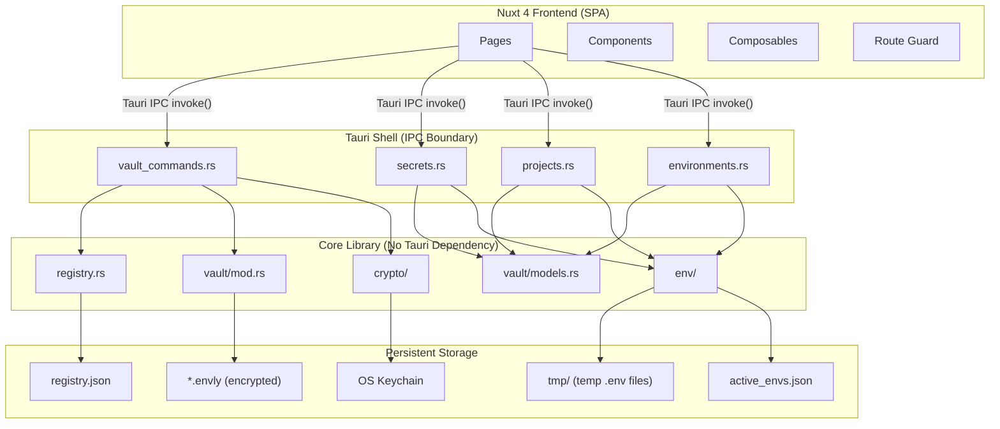
```mermaid
graph TB
    subgraph NuxtFrontend ["Nuxt 4 Frontend (SPA)"]
        direction TB
        Pages["Pages"]
        Components["Components"]
        Composables["Composables"]
        Middleware["Route Guard"]
    end

    subgraph TauriShell ["Tauri Shell (IPC Boundary)"]
        direction TB
        VaultCmd["vault_commands.rs"]
        SecretCmd["secrets.rs"]
        ProjectCmd["projects.rs"]
        EnvCmd["environments.rs"]
    end

    subgraph CoreLib ["Core Library (No Tauri Dependency)"]
        direction TB
        Registry["registry.rs"]
        VaultMod["vault/mod.rs"]
        Models["vault/models.rs"]
        CryptoMod["crypto/"]
        EnvMod["env/"]
    end

    subgraph Storage ["Persistent Storage"]
        direction TB
        RegistryJSON["registry.json"]
        VaultFile["*.envly (encrypted)"]
        Keychain["OS Keychain"]
        TempFiles["tmp/ (temp .env files)"]
        Manifest["active_envs.json"]
    end

    Pages -->|"Tauri IPC invoke()"| VaultCmd
    Pages -->|"Tauri IPC invoke()"| SecretCmd
    Pages -->|"Tauri IPC invoke()"| ProjectCmd
    Pages -->|"Tauri IPC invoke()"| EnvCmd

    VaultCmd --> Registry
    VaultCmd --> VaultMod
    VaultCmd --> CryptoMod
    SecretCmd --> Models
    SecretCmd --> EnvMod
    ProjectCmd --> Models
    ProjectCmd --> EnvMod
    EnvCmd --> Models
    EnvCmd --> EnvMod

    Registry --> RegistryJSON
    VaultMod --> VaultFile
    CryptoMod --> Keychain
    EnvMod --> TempFiles
    EnvMod --> Manifest
```

The application is split into two processes:

- **Frontend**: A Nuxt 4 SPA (SSR disabled) using `@nuxt/ui` and `@nuxtjs/i18n`. It communicates with the backend exclusively through Tauri IPC `invoke()` calls. No direct file system or network access.
- **Backend**: A Rust binary managed by Tauri. It is split into a thin **command layer** (IPC boundary) and a standalone **core library** containing all business logic, crypto, and storage. The core has zero Tauri dependencies and is fully unit-testable.

---

## 2. Frontend Architecture

### 2.1 Project Structure

```
app/
├── app.vue                        # Root: UApp > NuxtLayout > NuxtPage
├── app.config.ts                  # Nuxt UI theme (purple/zinc)
├── assets/css/main.css            # Tailwind + Nuxt UI imports
├── layouts/
│   ├── auth.vue                   # Minimal full-screen layout
│   └── default.vue                # Main app layout with navigation
├── middleware/
│   └── vault-guard.global.ts      # Global route guard
├── pages/
│   ├── index.vue                  # Entry redirect
│   ├── vaults.vue                 # Vault list and selection
│   ├── setup.vue                  # New vault wizard
│   ├── unlock.vue                 # Vault unlock
│   ├── dashboard.vue              # Project overview
│   ├── secrets.vue                # Secrets management
│   ├── settings.vue               # Vault settings
│   └── projects/
│       ├── index.vue              # Project list
│       └── [id].vue               # Project detail + environments
├── components/
│   ├── VaultCard.vue              # Vault entry card
│   ├── SecretFormModal.vue        # Create/edit secret
│   ├── ProjectFormModal.vue       # Create/edit project
│   ├── EnvironmentFormModal.vue   # Create/edit environment
│   ├── CloneProjectModal.vue      # Clone project
│   ├── CloneEnvironmentModal.vue  # Clone environment
│   └── BulkSecretImportModal.vue  # Bulk .env import
└── composables/
    └── useTauri.ts                # Typed IPC wrappers
```

### 2.2 Layouts

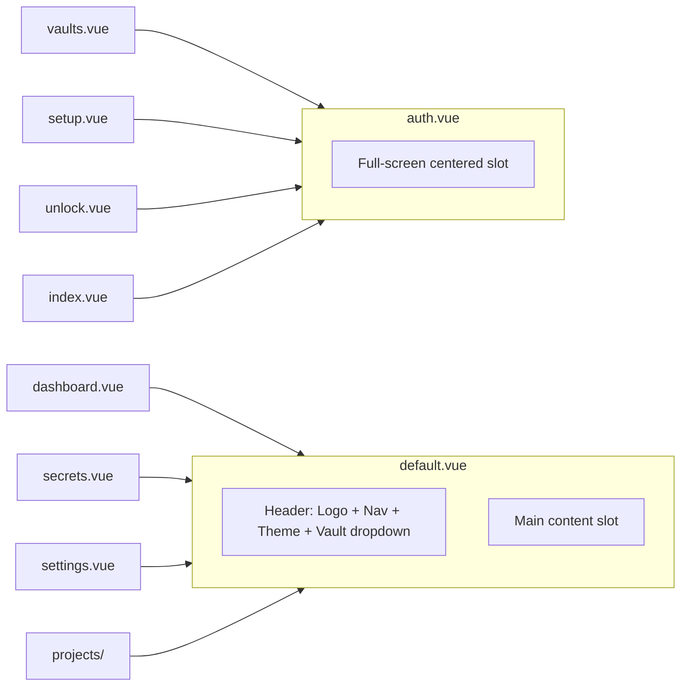
```mermaid
graph LR
    subgraph AuthLayout ["auth.vue"]
        AuthSlot["Full-screen centered slot"]
    end
    subgraph DefaultLayout ["default.vue"]
        Header["Header: Logo + Nav + Theme + Vault dropdown"]
        Main["Main content slot"]
    end

    Vaults["vaults.vue"] --> AuthLayout
    Setup["setup.vue"] --> AuthLayout
    Unlock["unlock.vue"] --> AuthLayout
    Index["index.vue"] --> AuthLayout

    Dashboard["dashboard.vue"] --> DefaultLayout
    Secrets["secrets.vue"] --> DefaultLayout
    Settings["settings.vue"] --> DefaultLayout
    Projects["projects/"] --> DefaultLayout
```

| Layout | File | Used By | Features |
|--------|------|---------|----------|
| `auth` | `layouts/auth.vue` | `index`, `vaults`, `setup`, `unlock` | Minimal full-height flex container, no navigation |
| `default` | `layouts/default.vue` | `dashboard`, `secrets`, `projects/*`, `settings` | Header with nav links (Dashboard, Secrets, Projects, Settings), theme toggle (light/dark/system), vault dropdown (Lock, Switch vault) |

The default layout header calls `lockVault` when the user locks or switches vaults, then navigates to `/unlock` or `/vaults` respectively.

### 2.3 Pages and Routing

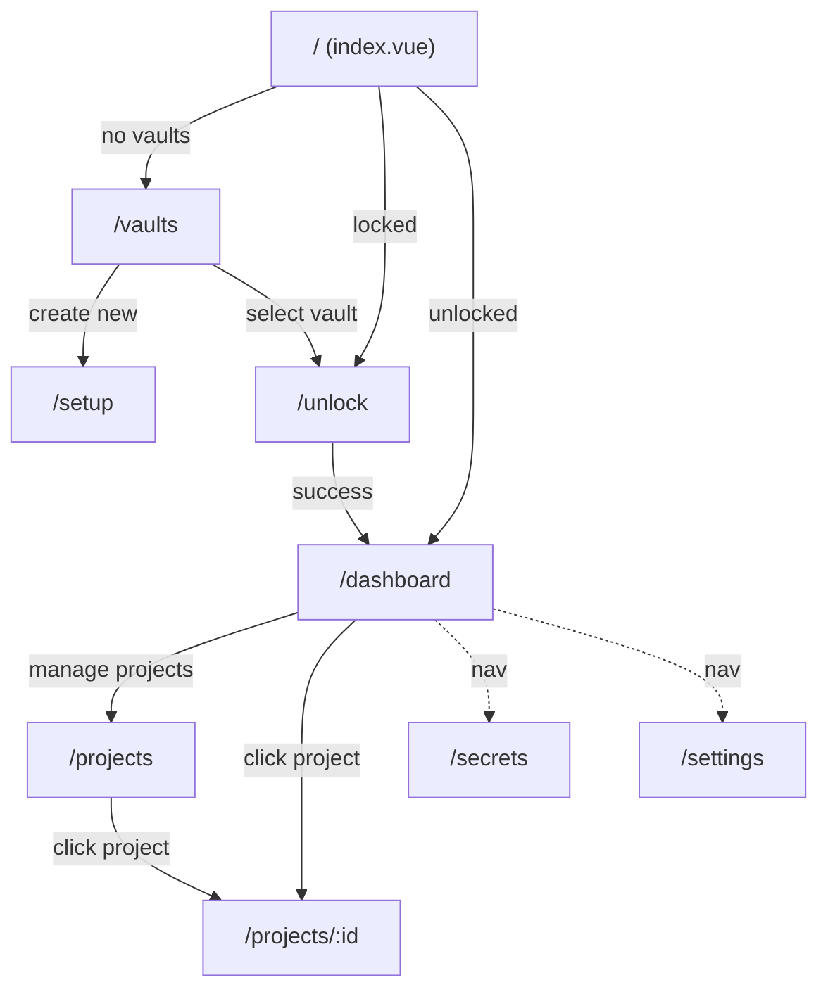
```mermaid
graph TD
    IndexPage["/  (index.vue)"] -->|"no vaults"| VaultsPage
    IndexPage -->|"locked"| UnlockPage
    IndexPage -->|"unlocked"| DashboardPage

    VaultsPage["/vaults"] -->|"create new"| SetupPage["/setup"]
    VaultsPage -->|"select vault"| UnlockPage["/unlock"]
    UnlockPage -->|"success"| DashboardPage["/dashboard"]

    DashboardPage -->|"manage projects"| ProjectsIndex["/projects"]
    DashboardPage -->|"click project"| ProjectDetail["/projects/:id"]
    ProjectsIndex -->|"click project"| ProjectDetail

    DashboardPage -.->|"nav"| SecretsPage["/secrets"]
    DashboardPage -.->|"nav"| SettingsPage["/settings"]
```

#### Page Details

**`/` (index.vue)** | Layout: `auth`
- Entry point. Checks vault state on mount and redirects.
- Commands: `listVaults`, `getActiveVaultId`, `getVaultStatus`
- Redirects: no vaults -> `/vaults`, locked -> `/unlock`, unlocked -> `/dashboard`

**`/vaults` (vaults.vue)** | Layout: `auth`
- Lists all registered vaults. Create, import, select, or delete vaults.
- Commands: `listVaults`, `selectVault`, `deleteVaultEntry`, `importVaultEntry`
- Components: `VaultCard`
- Includes a locale selector for changing the app language.

**`/setup` (setup.vue)** | Layout: `auth`
- Wizard for creating a new vault. Name, file path (folder picker), cipher mode (passphrase or keychain), passphrase fields.
- Commands: `createVaultEntry`, `checkPathExists`
- On success: navigates to `/dashboard`

**`/unlock` (unlock.vue)** | Layout: `auth`
- Unlocks the selected vault. Shows passphrase form or keychain button depending on cipher.
- Commands: `unlockVault`, `getVaultStatus`, `listVaults`, `getActiveVaultId`
- On success: navigates to `/dashboard`

**`/dashboard` (dashboard.vue)** | Layout: `default`
- Overview of all projects. Each project card shows environments with activation toggle.
- Commands: `listProjects`, `listEnvironments`, `activateEnvironment`, `deactivateEnvironment`, `toggleProjectStarred`
- Starred projects appear first.

**`/secrets` (secrets.vue)** | Layout: `default`
- Global secrets management. Search, create, edit, delete, reveal values, bulk import.
- Commands: `listSecrets`, `deleteSecret`, `revealSecretValue`
- Components: `SecretFormModal`, `BulkSecretImportModal`

**`/settings` (settings.vue)** | Layout: `default`
- Vault configuration. Rename, change passphrase, export, migrate cipher, change language, delete vault.
- Commands: `listVaults`, `getActiveVaultId`, `renameVault`, `changePassphrase`, `exportVault`, `deleteVaultEntry`, `lockVault`, `getActiveVaultCipherKind`, `migrateCipher`

**`/projects` (projects/index.vue)** | Layout: `default`
- Lists all projects. Create, edit, delete, clone.
- Commands: `listProjects`, `deleteProject`
- Components: `ProjectFormModal`, `CloneProjectModal`

**`/projects/:id` (projects/[id].vue)** | Layout: `default`
- Project detail. Environment management, mapping management.
- Route param: `id` (project UUID)
- Commands: `listProjects`, `listEnvironments`, `listMappings`, `listSecrets`, `deleteEnvironment`, `activateEnvironment`, `deactivateEnvironment`, `addMapping`, `removeMapping`
- Components: `EnvironmentFormModal`, `CloneEnvironmentModal`

### 2.4 Components

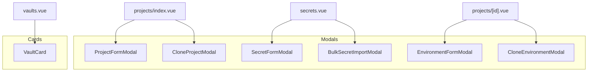
```mermaid
graph TD
    subgraph Modals
        SecretFormModal["SecretFormModal"]
        ProjectFormModal["ProjectFormModal"]
        EnvironmentFormModal["EnvironmentFormModal"]
        CloneProjectModal["CloneProjectModal"]
        CloneEnvironmentModal["CloneEnvironmentModal"]
        BulkSecretImportModal["BulkSecretImportModal"]
    end
    subgraph Cards
        VaultCard["VaultCard"]
    end

    SecretsPage["secrets.vue"] --> SecretFormModal
    SecretsPage --> BulkSecretImportModal
    ProjectsIndex["projects/index.vue"] --> ProjectFormModal
    ProjectsIndex --> CloneProjectModal
    ProjectDetail["projects/[id].vue"] --> EnvironmentFormModal
    ProjectDetail --> CloneEnvironmentModal
    VaultsPage["vaults.vue"] --> VaultCard
```

| Component | Props | Emits | Commands Called |
|-----------|-------|-------|----------------|
| `VaultCard` | `vault: VaultEntrySummary` | `select`, `delete` | — |
| `SecretFormModal` | `secret: SecretSummary \| null` | `saved` | `createSecret`, `updateSecret`, `revealSecretValue` |
| `ProjectFormModal` | `project: ProjectSummary \| null` | `saved` | `createProject`, `updateProject` |
| `EnvironmentFormModal` | `environment: EnvironmentSummary \| null`, `projectId: string` | `saved` | `createEnvironment`, `updateEnvironment` |
| `CloneProjectModal` | `project: ProjectSummary \| null` | `cloned` | `cloneProject` |
| `CloneEnvironmentModal` | `environment: EnvironmentSummary \| null`, `projectId: string` | `cloned` | `cloneEnvironment`, `listProjects` |
| `BulkSecretImportModal` | `existingSecrets: SecretSummary[]` | `imported` | `parseEnvFile`, `bulkCreateSecrets` |

All modals use `defineModel('open')` for visibility and emit a completion event (`saved`, `cloned`, `imported`) that the parent page uses to refresh data.

### 2.5 Composables

**`useTauri()`** (`composables/useTauri.ts`)

The single composable that wraps all Tauri IPC calls with typed signatures. It returns an object of async functions, each calling `invoke()` from `@tauri-apps/api/core` with the correct command name and arguments. It also defines all TypeScript interfaces for backend response types:

- `VaultEntrySummary` — vault registry entry
- `ProjectSummary` — project with active env info and path validity
- `SecretSummary` — secret without value (masked)
- `EnvironmentSummary` — environment with mapping count
- `MappingSummary` — mapping with resolved secret key
- `ParsedEnvEntry` — key/value from .env parsing
- `BulkCreateResult` — created/updated counts

### 2.6 Middleware

**`vault-guard.global.ts`**

A global Nuxt route guard that runs on every navigation. It enforces the vault lifecycle state machine:

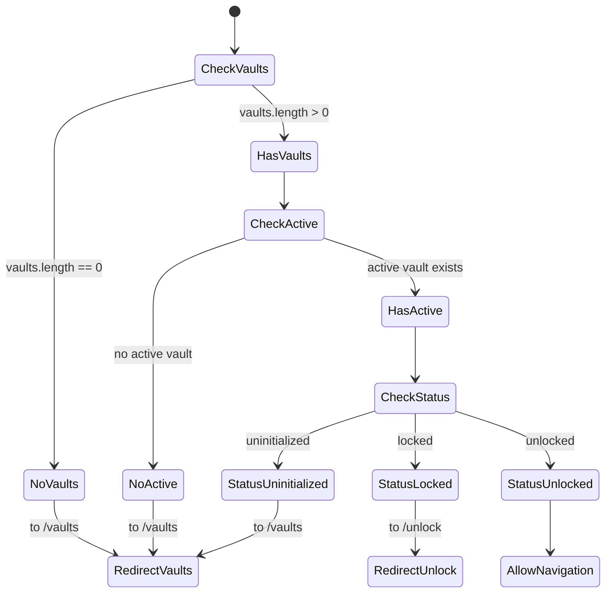
```mermaid
stateDiagram-v2
    [*] --> CheckVaults
    CheckVaults --> NoVaults: vaults.length == 0
    CheckVaults --> HasVaults: vaults.length > 0
    NoVaults --> RedirectVaults: to /vaults
    HasVaults --> CheckActive
    CheckActive --> NoActive: no active vault
    CheckActive --> HasActive: active vault exists
    NoActive --> RedirectVaults: to /vaults
    HasActive --> CheckStatus
    CheckStatus --> StatusUninitialized: uninitialized
    CheckStatus --> StatusLocked: locked
    CheckStatus --> StatusUnlocked: unlocked
    StatusUninitialized --> RedirectVaults: to /vaults
    StatusLocked --> RedirectUnlock: to /unlock
    StatusUnlocked --> AllowNavigation
```

Pages `/vaults` and `/setup` are always allowed (no guard). Page `/unlock` is allowed when locked. All other pages require an unlocked vault.

### 2.7 Page-to-Command Map


```mermaid
graph LR
    subgraph FrontendPages ["Frontend Pages"]
        P_index["index"]
        P_vaults["vaults"]
        P_setup["setup"]
        P_unlock["unlock"]
        P_dashboard["dashboard"]
        P_secrets["secrets"]
        P_settings["settings"]
        P_projects["projects/index"]
        P_projectDetail["projects/:id"]
    end

    subgraph VaultCommands ["Vault Commands"]
        C_listVaults["list_vaults"]
        C_getActiveVaultId["get_active_vault_id"]
        C_createVaultEntry["create_vault_entry"]
        C_deleteVaultEntry["delete_vault_entry"]
        C_renameVault["rename_vault"]
        C_importVaultEntry["import_vault_entry"]
        C_selectVault["select_vault"]
        C_checkPathExists["check_path_exists"]
        C_getVaultStatus["get_vault_status"]
        C_unlockVault["unlock_vault"]
        C_lockVault["lock_vault"]
        C_changePassphrase["change_passphrase"]
        C_exportVault["export_vault"]
        C_getCipherKind["get_active_vault_cipher_kind"]
        C_migrateCipher["migrate_cipher"]
    end

    subgraph SecretCommands ["Secret Commands"]
        C_listSecrets["list_secrets"]
        C_revealSecretValue["reveal_secret_value"]
        C_createSecret["create_secret"]
        C_updateSecret["update_secret"]
        C_deleteSecret["delete_secret"]
        C_parseEnvFile["parse_env_file"]
        C_bulkCreateSecrets["bulk_create_secrets"]
    end

    subgraph ProjectCommands ["Project Commands"]
        C_listProjects["list_projects"]
        C_createProject["create_project"]
        C_updateProject["update_project"]
        C_deleteProject["delete_project"]
        C_validateProjectPath["validate_project_path"]
        C_toggleProjectStarred["toggle_project_starred"]
        C_cloneProject["clone_project"]
    end

    subgraph EnvCommands ["Environment Commands"]
        C_listEnvironments["list_environments"]
        C_listMappings["list_mappings"]
        C_createEnvironment["create_environment"]
        C_updateEnvironment["update_environment"]
        C_deleteEnvironment["delete_environment"]
        C_activateEnvironment["activate_environment"]
        C_deactivateEnvironment["deactivate_environment"]
        C_addMapping["add_mapping"]
        C_removeMapping["remove_mapping"]
        C_cloneEnvironment["clone_environment"]
    end

    P_index --> C_listVaults
    P_index --> C_getActiveVaultId
    P_index --> C_getVaultStatus

    P_vaults --> C_listVaults
    P_vaults --> C_selectVault
    P_vaults --> C_deleteVaultEntry
    P_vaults --> C_importVaultEntry

    P_setup --> C_createVaultEntry
    P_setup --> C_checkPathExists

    P_unlock --> C_unlockVault
    P_unlock --> C_getVaultStatus
    P_unlock --> C_listVaults
    P_unlock --> C_getActiveVaultId

    P_dashboard --> C_listProjects
    P_dashboard --> C_listEnvironments
    P_dashboard --> C_activateEnvironment
    P_dashboard --> C_deactivateEnvironment
    P_dashboard --> C_toggleProjectStarred

    P_secrets --> C_listSecrets
    P_secrets --> C_deleteSecret
    P_secrets --> C_revealSecretValue
    P_secrets --> C_createSecret
    P_secrets --> C_updateSecret
    P_secrets --> C_parseEnvFile
    P_secrets --> C_bulkCreateSecrets

    P_settings --> C_listVaults
    P_settings --> C_getActiveVaultId
    P_settings --> C_renameVault
    P_settings --> C_changePassphrase
    P_settings --> C_exportVault
    P_settings --> C_deleteVaultEntry
    P_settings --> C_lockVault
    P_settings --> C_getCipherKind
    P_settings --> C_migrateCipher

    P_projects --> C_listProjects
    P_projects --> C_deleteProject
    P_projects --> C_createProject
    P_projects --> C_updateProject
    P_projects --> C_cloneProject

    P_projectDetail --> C_listProjects
    P_projectDetail --> C_listEnvironments
    P_projectDetail --> C_listMappings
    P_projectDetail --> C_listSecrets
    P_projectDetail --> C_deleteEnvironment
    P_projectDetail --> C_activateEnvironment
    P_projectDetail --> C_deactivateEnvironment
    P_projectDetail --> C_addMapping
    P_projectDetail --> C_removeMapping
    P_projectDetail --> C_createEnvironment
    P_projectDetail --> C_updateEnvironment
    P_projectDetail --> C_cloneEnvironment
```

---

## 3. Backend Architecture

### 3.1 Module Hierarchy

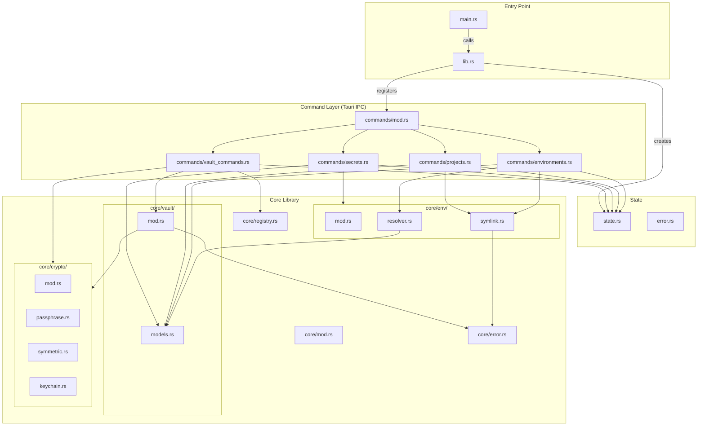
```mermaid
graph TD
    subgraph entrypoint ["Entry Point"]
        main_rs["main.rs"]
        lib_rs["lib.rs"]
    end

    subgraph commandLayer ["Command Layer (Tauri IPC)"]
        cmd_mod["commands/mod.rs"]
        vault_cmds["commands/vault_commands.rs"]
        secret_cmds["commands/secrets.rs"]
        project_cmds["commands/projects.rs"]
        env_cmds["commands/environments.rs"]
    end

    subgraph stateLayer ["State"]
        state_rs["state.rs"]
        error_rs["error.rs"]
    end

    subgraph coreLayer ["Core Library"]
        core_mod["core/mod.rs"]
        core_error["core/error.rs"]
        registry["core/registry.rs"]

        subgraph vaultModule ["core/vault/"]
            vault_mod["mod.rs"]
            vault_models["models.rs"]
        end

        subgraph cryptoModule ["core/crypto/"]
            crypto_mod["mod.rs"]
            passphrase["passphrase.rs"]
            symmetric["symmetric.rs"]
            keychain["keychain.rs"]
        end

        subgraph envModule ["core/env/"]
            env_mod["mod.rs"]
            resolver["resolver.rs"]
            symlink["symlink.rs"]
        end
    end

    main_rs -->|"calls"| lib_rs
    lib_rs -->|"registers"| cmd_mod
    lib_rs -->|"creates"| state_rs

    cmd_mod --> vault_cmds
    cmd_mod --> secret_cmds
    cmd_mod --> project_cmds
    cmd_mod --> env_cmds

    vault_cmds --> state_rs
    vault_cmds --> registry
    vault_cmds --> vault_mod
    vault_cmds --> cryptoModule

    secret_cmds --> state_rs
    secret_cmds --> vault_models
    secret_cmds --> envModule

    project_cmds --> state_rs
    project_cmds --> vault_models
    project_cmds --> symlink

    env_cmds --> state_rs
    env_cmds --> vault_models
    env_cmds --> resolver
    env_cmds --> symlink

    vault_mod --> cryptoModule
    vault_mod --> core_error
    resolver --> vault_models
    symlink --> core_error
```

### 3.2 Application Lifecycle

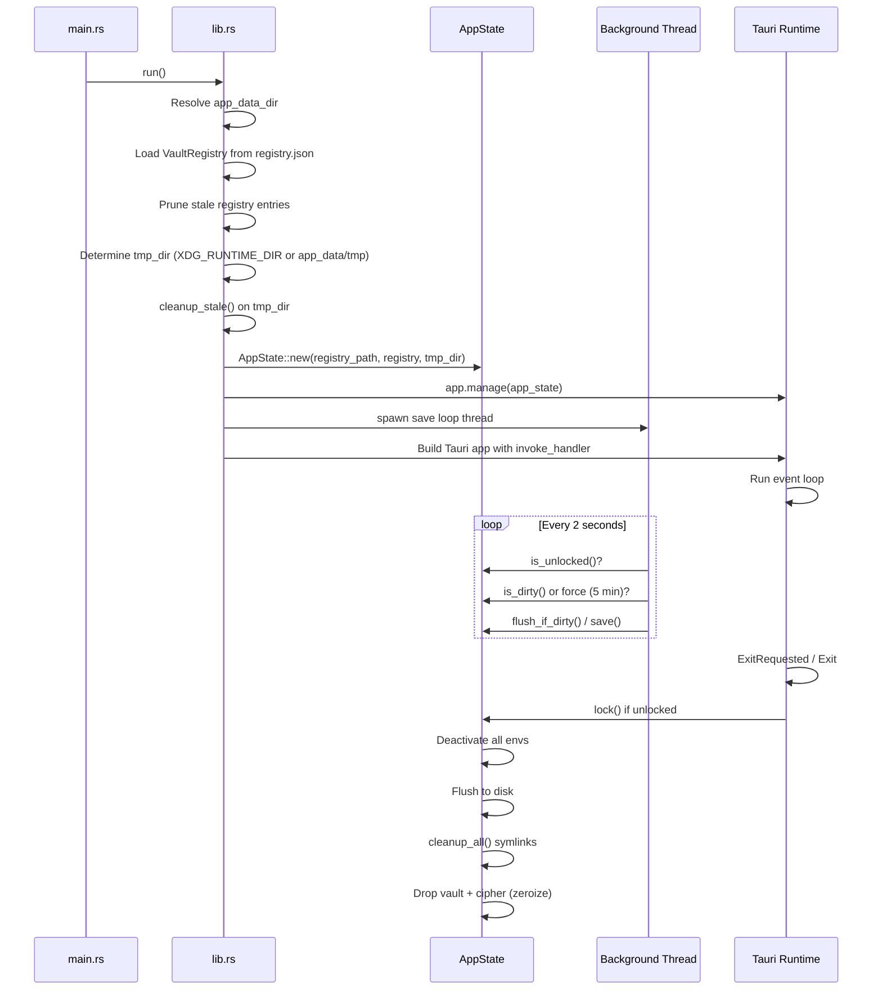
```mermaid
sequenceDiagram
    participant M as main.rs
    participant L as lib.rs
    participant S as AppState
    participant BG as Background Thread
    participant T as Tauri Runtime

    M->>L: run()
    L->>L: Resolve app_data_dir
    L->>L: Load VaultRegistry from registry.json
    L->>L: Prune stale registry entries
    L->>L: Determine tmp_dir (XDG_RUNTIME_DIR or app_data/tmp)
    L->>L: cleanup_stale() on tmp_dir
    L->>S: AppState::new(registry_path, registry, tmp_dir)
    L->>T: app.manage(app_state)
    L->>BG: spawn save loop thread
    L->>T: Build Tauri app with invoke_handler
    T->>T: Run event loop

    loop Every 2 seconds
        BG->>S: is_unlocked()?
        BG->>S: is_dirty() or force (5 min)?
        BG->>S: flush_if_dirty() / save()
    end

    T->>T: ExitRequested / Exit
    T->>S: lock() if unlocked
    S->>S: Deactivate all envs
    S->>S: Flush to disk
    S->>S: cleanup_all() symlinks
    S->>S: Drop vault + cipher (zeroize)
```

Key lifecycle details:

- **Startup**: Load registry, prune stale vaults whose files no longer exist, clean up stale symlinks from crashed sessions (by PID and 24-hour TTL).
- **Background save**: A dedicated thread checks every 2 seconds. If the vault is dirty (mutated since last save), it flushes to disk. Every 5 minutes it forces a save regardless.
- **Shutdown**: On `ExitRequested` or `Exit`, the vault is locked (deactivating all environments, cleaning up symlinks, flushing to disk, and zeroizing secrets in memory).

### 3.3 State Management

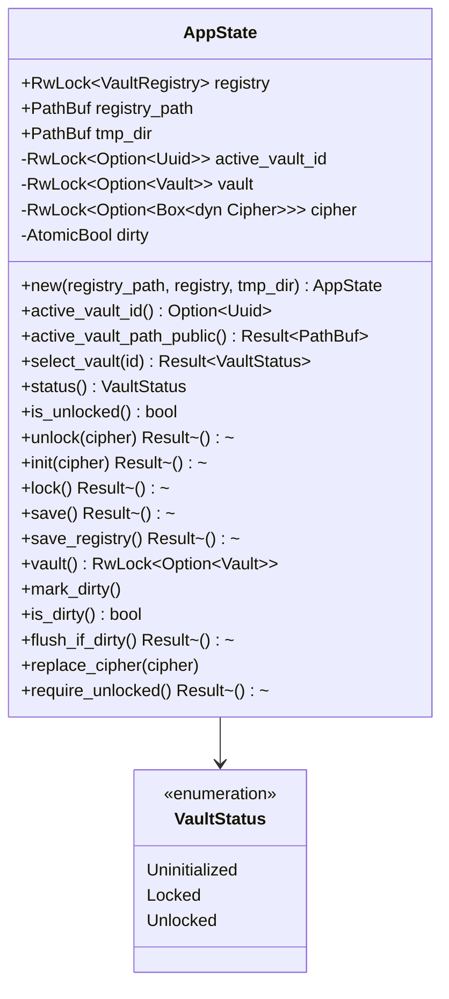
```mermaid
classDiagram
    class AppState {
        +RwLock~VaultRegistry~ registry
        +PathBuf registry_path
        +PathBuf tmp_dir
        -RwLock~Option~Uuid~~ active_vault_id
        -RwLock~Option~Vault~~ vault
        -RwLock~Option~Box~dyn Cipher~~~ cipher
        -AtomicBool dirty

        +new(registry_path, registry, tmp_dir) AppState
        +active_vault_id() Option~Uuid~
        +active_vault_path_public() Result~PathBuf~
        +select_vault(id) Result~VaultStatus~
        +status() VaultStatus
        +is_unlocked() bool
        +unlock(cipher) Result~()~
        +init(cipher) Result~()~
        +lock() Result~()~
        +save() Result~()~
        +save_registry() Result~()~
        +vault() RwLock~Option~Vault~~
        +mark_dirty()
        +is_dirty() bool
        +flush_if_dirty() Result~()~
        +replace_cipher(cipher)
        +require_unlocked() Result~()~
    }

    class VaultStatus {
        <<enumeration>>
        Uninitialized
        Locked
        Unlocked
    }

    AppState --> VaultStatus
```

**File**: `src-tauri/src/state.rs`

`AppState` is the central managed state in the Tauri application. It holds:

| Field | Type | Purpose |
|-------|------|---------|
| `registry` | `RwLock<VaultRegistry>` | The vault registry (list of known vaults) |
| `registry_path` | `PathBuf` | Path to `registry.json` on disk |
| `tmp_dir` | `PathBuf` | Directory for temp .env files |
| `active_vault_id` | `RwLock<Option<Uuid>>` | Currently selected vault |
| `vault` | `RwLock<Option<Vault>>` | Decrypted vault in memory (`None` = locked) |
| `cipher` | `RwLock<Option<Box<dyn Cipher>>>` | Active cipher for encrypt/decrypt |
| `dirty` | `AtomicBool` | Whether vault has unsaved mutations |

All mutable fields use `RwLock` for concurrent read access from the background save thread and the main IPC thread. The `dirty` flag uses `AtomicBool` for lock-free dirty checking.

### 3.4 Command Layer

The command layer lives in `src-tauri/src/commands/` and contains four modules. Each command is a thin function annotated with `#[tauri::command]` that:

1. Calls `state.require_unlocked()` if the command needs an open vault
2. Acquires read or write locks on the vault
3. Delegates to core library functions
4. Calls `state.mark_dirty()` on mutations
5. Converts `EnvlyError` to `String` via `map_err(map_err)` for the Tauri IPC boundary

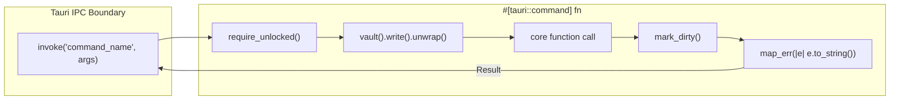
```mermaid
graph LR
    subgraph IPC ["Tauri IPC Boundary"]
        Invoke["invoke('command_name', args)"]
    end

    subgraph CommandFn ["#[tauri::command] fn"]
        RequireUnlocked["require_unlocked()"]
        AcquireLock["vault().write().unwrap()"]
        CallCore["core function call"]
        MarkDirty["mark_dirty()"]
        MapErr["map_err(|e| e.to_string())"]
    end

    Invoke --> RequireUnlocked
    RequireUnlocked --> AcquireLock
    AcquireLock --> CallCore
    CallCore --> MarkDirty
    MarkDirty --> MapErr
    MapErr -->|"Result<T, String>"| Invoke
```

### 3.5 Core Library

The core library lives in `src-tauri/src/core/` and has zero Tauri dependencies. This makes it fully testable in isolation.

#### 3.5.1 Registry (`core/registry.rs`)

**File**: `src-tauri/src/core/registry.rs`

Manages the `registry.json` file that tracks all known vaults.

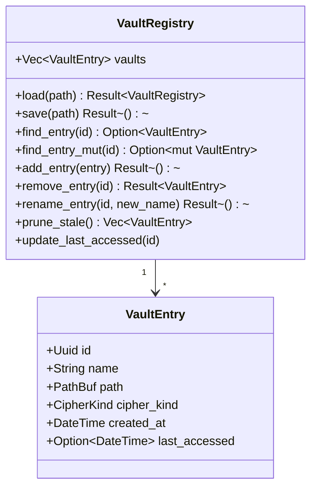
```mermaid
classDiagram
    class VaultRegistry {
        +Vec~VaultEntry~ vaults
        +load(path) Result~VaultRegistry~
        +save(path) Result~()~
        +find_entry(id) Option~VaultEntry~
        +find_entry_mut(id) Option~mut VaultEntry~
        +add_entry(entry) Result~()~
        +remove_entry(id) Result~VaultEntry~
        +rename_entry(id, new_name) Result~()~
        +prune_stale() Vec~VaultEntry~
        +update_last_accessed(id)
    }

    class VaultEntry {
        +Uuid id
        +String name
        +PathBuf path
        +CipherKind cipher_kind
        +DateTime created_at
        +Option~DateTime~ last_accessed
    }

    VaultRegistry "1" --> "*" VaultEntry
```

| Method | Behavior |
|--------|----------|
| `load` | Reads and deserializes `registry.json`. Returns empty registry if file doesn't exist. |
| `save` | Serializes to pretty JSON and writes to disk. Creates parent directories. |
| `add_entry` | Validates name and path uniqueness, then appends. |
| `remove_entry` | Finds by ID and removes. Returns the removed entry. |
| `rename_entry` | Validates new name doesn't collide, then updates. |
| `prune_stale` | Removes entries whose vault file no longer exists on disk. |
| `update_last_accessed` | Sets `last_accessed` to now. |

#### 3.5.2 Vault File Operations (`core/vault/mod.rs`)

**File**: `src-tauri/src/core/vault/mod.rs`

Handles reading and writing encrypted vault files.

| Function | Behavior |
|----------|----------|
| `vault_exists(path)` | Returns `true` if the file exists. |
| `create_vault(path, cipher)` | Creates a new empty `Vault`, encrypts it, and writes to disk. |
| `load_vault(path, cipher)` | Reads the file, deserializes the `VaultFile` wrapper, decrypts the payload, deserializes the inner `Vault`. |
| `save_vault(path, cipher, vault)` | Serializes vault to JSON, encrypts, wraps in `VaultFile`, writes atomically (temp file + rename). Creates a `.bak` backup before overwriting, removes it on success. |

The `VaultFile` on-disk format:

```json
{
  "cipher_version": 1,
  "cipher_kind": "passphrase",
  "payload": {
    "ciphertext": "<base64>",
    "nonce": "<base64>",
    "salt": "<base64 or null>"
  }
}
```

#### 3.5.3 Data Models (`core/vault/models.rs`)

**File**: `src-tauri/src/core/vault/models.rs`

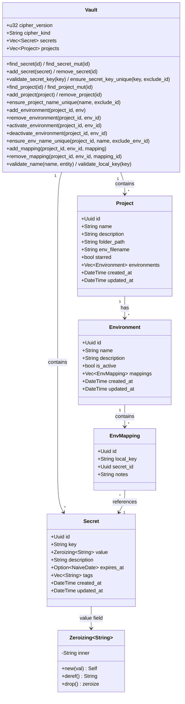
```mermaid
classDiagram
    class Vault {
        +u32 cipher_version
        +String cipher_kind
        +Vec~Secret~ secrets
        +Vec~Project~ projects
        +find_secret(id) / find_secret_mut(id)
        +add_secret(secret) / remove_secret(id)
        +validate_secret_key(key) / ensure_secret_key_unique(key, exclude_id)
        +find_project(id) / find_project_mut(id)
        +add_project(project) / remove_project(id)
        +ensure_project_name_unique(name, exclude_id)
        +add_environment(project_id, env)
        +remove_environment(project_id, env_id)
        +activate_environment(project_id, env_id)
        +deactivate_environment(project_id, env_id)
        +ensure_env_name_unique(project_id, name, exclude_env_id)
        +add_mapping(project_id, env_id, mapping)
        +remove_mapping(project_id, env_id, mapping_id)
        +validate_name(name, entity) / validate_local_key(key)
    }

    class Secret {
        +Uuid id
        +String key
        +Zeroizing~String~ value
        +String description
        +Option~NaiveDate~ expires_at
        +Vec~String~ tags
        +DateTime created_at
        +DateTime updated_at
    }

    class Project {
        +Uuid id
        +String name
        +String description
        +String folder_path
        +String env_filename
        +bool starred
        +Vec~Environment~ environments
        +DateTime created_at
        +DateTime updated_at
    }

    class Environment {
        +Uuid id
        +String name
        +String description
        +bool is_active
        +Vec~EnvMapping~ mappings
        +DateTime created_at
        +DateTime updated_at
    }

    class EnvMapping {
        +Uuid id
        +String local_key
        +Uuid secret_id
        +String notes
    }

    class ZeroizingString ["Zeroizing&lt;String&gt;"] {
        -String inner
        +new(val) Self
        +deref() String
        +drop() zeroize
    }

    Vault "1" --> "*" Secret : contains
    Vault "1" --> "*" Project : contains
    Project "1" --> "*" Environment : has
    Environment "1" --> "*" EnvMapping : contains
    EnvMapping "*" --> "1" Secret : references
    Secret --> ZeroizingString : value field
```

Key behaviors:

- **`add_secret`**: Validates key is non-empty, checks for duplicate keys, appends.
- **`remove_secret`**: Scans all mappings across all projects/environments. If any mapping references this secret, deletion is rejected with an error listing the dependent mapping.
- **`activate_environment`**: Sets `is_active = true` on the target env and `false` on all others in the same project (only one active env per project).
- **`add_mapping`**: Validates the referenced secret exists, the local_key is non-empty and unique within the environment.
- **`Zeroizing<String>`**: Custom wrapper that implements `Drop` to call `zeroize()` on the inner string, and `Debug` to print `[REDACTED]`.

### 3.6 Crypto Module

**Directory**: `src-tauri/src/core/crypto/`

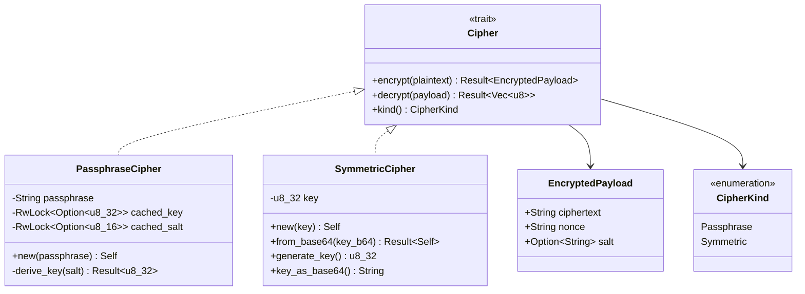
```mermaid
classDiagram
    class Cipher {
        <<trait>>
        +encrypt(plaintext) Result~EncryptedPayload~
        +decrypt(payload) Result~Vec~u8~~
        +kind() CipherKind
    }

    class CipherKind {
        <<enumeration>>
        Passphrase
        Symmetric
    }

    class EncryptedPayload {
        +String ciphertext
        +String nonce
        +Option~String~ salt
    }

    class PassphraseCipher {
        -String passphrase
        -RwLock~Option~u8_32~~ cached_key
        -RwLock~Option~u8_16~~ cached_salt
        +new(passphrase) Self
        -derive_key(salt) Result~u8_32~
    }

    class SymmetricCipher {
        -u8_32 key
        +new(key) Self
        +from_base64(key_b64) Result~Self~
        +generate_key() u8_32
        +key_as_base64() String
    }

    Cipher <|.. PassphraseCipher
    Cipher <|.. SymmetricCipher
    Cipher --> EncryptedPayload
    Cipher --> CipherKind
```

#### PassphraseCipher (`passphrase.rs`)

- **KDF**: Argon2id with 64 MiB memory, 3 iterations, 4 parallelism, producing a 256-bit key.
- **Cipher**: XChaCha20-Poly1305 (AEAD).
- **Encrypt**: Generates random 16-byte salt (if not cached), derives key via Argon2id, generates random 24-byte nonce, encrypts, returns base64-encoded payload with salt.
- **Decrypt**: Decodes salt from payload, validates salt length (16 bytes), derives key, validates nonce length (24 bytes), decrypts. Caches the derived key and salt for subsequent operations.
- **Drop**: Zeroizes the passphrase and cached key.

#### SymmetricCipher (`symmetric.rs`)

- **Cipher**: XChaCha20-Poly1305 (AEAD) with a raw 256-bit key.
- **Encrypt**: Generates random 24-byte nonce, encrypts, returns base64-encoded payload (no salt).
- **Decrypt**: Validates nonce length (24 bytes), decrypts.
- **Drop**: Zeroizes the key.

#### Keychain (`keychain.rs`)

- **Service**: `com.envly.envly`
- **Entry name**: `vault-master-key-{vault_id}`
- **`store_key`**: Base64-encodes the 32-byte key and stores it in the OS keychain.
- **`retrieve_key`**: Retrieves from keychain, base64-decodes, validates length (32 bytes).
- **`delete_key`**: Removes the credential from the keychain.

### 3.7 Env Module

**Directory**: `src-tauri/src/core/env/`

#### Resolver (`resolver.rs`)

| Function | Signature | Behavior |
|----------|-----------|----------|
| `resolve_environment` | `(vault, project_id, env_id) -> Result<Vec<(String, String)>>` | Looks up the project and environment, iterates mappings, resolves each `secret_id` to its decrypted value. Returns `(local_key, secret_value)` pairs. |
| `format_env_file` | `(resolved) -> String` | Formats as `.env` content. Values needing quoting (spaces, newlines, `#`, `=`, `"`, `'`, `\`, or empty) are wrapped in double quotes with proper escaping (`\\`, `\"`, `\n`, `\r`). |

#### Symlink (`symlink.rs`)

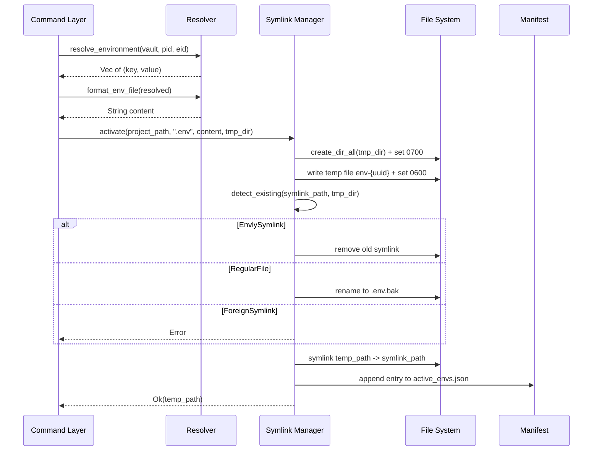
```mermaid
sequenceDiagram
    participant Cmd as Command Layer
    participant Res as Resolver
    participant Sym as Symlink Manager
    participant FS as File System
    participant Man as Manifest

    Cmd->>Res: resolve_environment(vault, pid, eid)
    Res-->>Cmd: Vec of (key, value)
    Cmd->>Res: format_env_file(resolved)
    Res-->>Cmd: String content

    Cmd->>Sym: activate(project_path, ".env", content, tmp_dir)
    Sym->>FS: create_dir_all(tmp_dir) + set 0700
    Sym->>FS: write temp file env-{uuid} + set 0600
    Sym->>Sym: detect_existing(symlink_path, tmp_dir)
    alt EnvlySymlink
        Sym->>FS: remove old symlink
    else RegularFile
        Sym->>FS: rename to .env.bak
    else ForeignSymlink
        Sym-->>Cmd: Error
    end
    Sym->>FS: symlink temp_path -> symlink_path
    Sym->>Man: append entry to active_envs.json
    Sym-->>Cmd: Ok(temp_path)
```

| Function | Behavior |
|----------|----------|
| `activate` | Creates a temp file in `tmp_dir` with the resolved .env content (0600 permissions), handles any existing file at the symlink target (backup regular files, replace Envly symlinks, reject foreign symlinks), creates the symlink, records the entry in the manifest. |
| `deactivate` | If the symlink is an Envly-managed symlink, removes the temp file and symlink. Updates the manifest. |
| `cleanup_all` | Removes all tracked temp files and symlinks. Empties the manifest. Called on vault lock. |
| `cleanup_stale` | Scans the manifest for entries from dead PIDs or older than 24 hours. Removes their files and symlinks. Called on startup. |
| `detect_existing` | Checks if a path is: nothing, an Envly symlink (target inside tmp_dir), a foreign symlink, or a regular file. |
| `can_create_symlinks` | Always true on Unix. On Windows, tests by creating a symlink in temp and checking if it succeeded. |

**Manifest format** (`active_envs.json`):

```json
{
  "entries": [
    {
      "id": "env-<uuid>",
      "temp_path": "/path/to/tmp/env-<uuid>",
      "symlink_path": "/path/to/project/.env",
      "pid": 12345,
      "created_at": "2026-03-10T12:00:00Z"
    }
  ]
}
```

### 3.8 Error Handling

**File**: `src-tauri/src/core/error.rs`

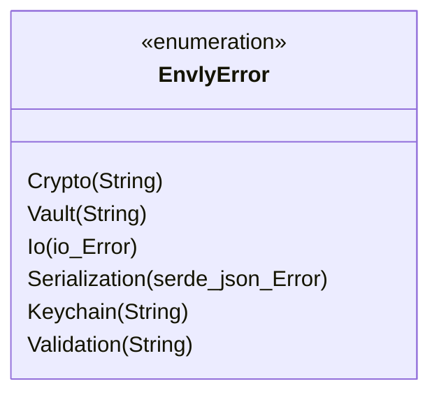
```mermaid
classDiagram
    class EnvlyError {
        <<enumeration>>
        Crypto(String)
        Vault(String)
        Io(io_Error)
        Serialization(serde_json_Error)
        Keychain(String)
        Validation(String)
    }
```

| Variant | Triggered By |
|---------|-------------|
| `Crypto` | Encryption/decryption failures, invalid salt/nonce length, wrong passphrase |
| `Vault` | Missing vault file, corrupt vault, no vault selected, vault locked |
| `Io` | File system operations (read, write, symlink, permissions) |
| `Serialization` | JSON parse/serialize failures |
| `Keychain` | OS keychain store/retrieve/delete failures |
| `Validation` | Business rule violations (duplicates, not found, empty names, referential integrity) |

At the command layer, all `EnvlyError` variants are converted to `String` via `Display` for the Tauri IPC boundary (`CmdResult<T> = Result<T, String>`).

---

## 4. Data Model

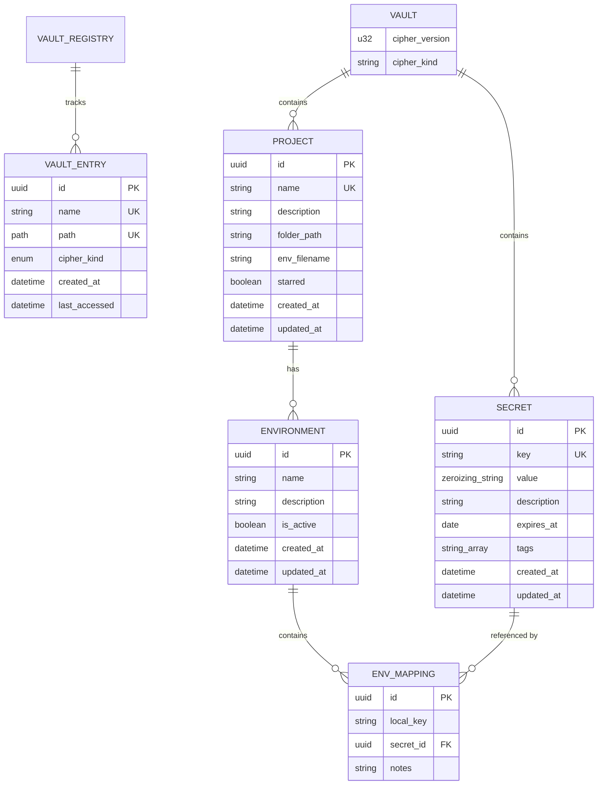
```mermaid
erDiagram
    VAULT_REGISTRY ||--o{ VAULT_ENTRY : tracks
    VAULT_ENTRY {
        uuid id PK
        string name UK
        path path UK
        enum cipher_kind
        datetime created_at
        datetime last_accessed
    }

    VAULT {
        u32 cipher_version
        string cipher_kind
    }

    SECRET {
        uuid id PK
        string key UK
        zeroizing_string value
        string description
        date expires_at
        string_array tags
        datetime created_at
        datetime updated_at
    }

    PROJECT {
        uuid id PK
        string name UK
        string description
        string folder_path
        string env_filename
        boolean starred
        datetime created_at
        datetime updated_at
    }

    ENVIRONMENT {
        uuid id PK
        string name
        string description
        boolean is_active
        datetime created_at
        datetime updated_at
    }

    ENV_MAPPING {
        uuid id PK
        string local_key
        uuid secret_id FK
        string notes
    }

    VAULT ||--o{ SECRET : contains
    VAULT ||--o{ PROJECT : contains
    PROJECT ||--o{ ENVIRONMENT : has
    ENVIRONMENT ||--o{ ENV_MAPPING : contains
    SECRET ||--o{ ENV_MAPPING : "referenced by"
```

There are two categories of persistent data:

1. **Vault Registry** (`registry.json`): Unencrypted JSON. Lives in the Tauri app data directory. Lists all known vault entries with their file paths and cipher kinds.

2. **Vault Files** (`*.envly`): Encrypted files at user-chosen locations. The entire vault (secrets, projects, environments, mappings) is serialized to JSON, encrypted as a single blob, and wrapped in a `VaultFile` structure with cipher metadata.

Constraints enforced in code:
- Secret keys are unique within a vault
- Project names are unique within a vault
- Environment names are unique within a project
- Local keys are unique within an environment
- A secret cannot be deleted while referenced by any mapping
- Only one environment per project can be active at a time
- Vault entry names and paths are unique in the registry

---

## 5. Command Reference

### Vault Registry Commands (`vault_commands.rs`)

| Command | Async | Args | Returns | Description |
|---------|-------|------|---------|-------------|
| `list_vaults` | No | — | `Vec<VaultEntrySummary>` | Lists all registered vaults |
| `get_active_vault_id` | No | — | `Option<Uuid>` | Returns the currently selected vault ID |
| `create_vault_entry` | Yes | `name`, `path`, `cipher_kind`, `passphrase?` | `Uuid` | Creates a new vault, adds to registry, initializes, and unlocks |
| `delete_vault_entry` | Yes | `id`, `delete_file` | `()` | Locks if active, removes from registry, optionally deletes file |
| `rename_vault` | No | `id`, `new_name` | `()` | Renames a vault entry in the registry |
| `import_vault_entry` | No | `name`, `path` | `Uuid` | Reads cipher kind from vault file header, adds to registry |
| `select_vault` | No | `id` | `VaultStatus` | Locks current vault, selects new one, returns its status |
| `check_path_exists` | No | `path` | `bool` | Checks if a file/directory exists at the given path |

### Vault Lifecycle Commands (`vault_commands.rs`)

| Command | Async | Args | Returns | Description |
|---------|-------|------|---------|-------------|
| `get_vault_status` | No | — | `VaultStatus` | Returns `uninitialized`, `locked`, or `unlocked` |
| `unlock_vault` | Yes | `passphrase?` | `()` | Decrypts and loads vault into memory |
| `lock_vault` | No | — | `()` | Deactivates all envs, flushes, cleans up, zeroizes |
| `change_passphrase` | Yes | `new_passphrase` | `()` | Re-encrypts vault with new passphrase, lock + unlock cycle |
| `export_vault` | Yes | `destination`, `passphrase` | `()` | Saves encrypted copy to a different path with a given passphrase |
| `get_active_vault_cipher_kind` | No | — | `String` | Returns `"passphrase"` or `"symmetric"` |
| `migrate_cipher` | Yes | `target_kind`, `passphrase?` | `()` | Switches cipher mode, re-encrypts vault, updates registry |

### Secret Commands (`secrets.rs`)

| Command | Async | Args | Returns | Description |
|---------|-------|------|---------|-------------|
| `list_secrets` | No | — | `Vec<SecretSummary>` | Lists all secrets (values masked) |
| `reveal_secret_value` | No | `id` | `String` | Returns the plaintext value of a single secret |
| `create_secret` | No | `key`, `value`, `description?`, `expires_at?`, `tags?` | `Uuid` | Creates a new secret |
| `update_secret` | No | `id`, `key?`, `value?`, `description?`, `expires_at?`, `tags?` | `()` | Updates a secret. Refreshes active symlinks if value changed |
| `delete_secret` | No | `id` | `()` | Deletes a secret (blocked if referenced by mappings) |
| `parse_env_file` | No | `path` | `Vec<ParsedEnvEntry>` | Parses a `.env` file into key/value pairs |
| `bulk_create_secrets` | No | `entries: Vec<BulkSecretEntry>` | `BulkCreateResult` | Creates or updates secrets in bulk. Refreshes affected symlinks |

### Project Commands (`projects.rs`)

| Command | Async | Args | Returns | Description |
|---------|-------|------|---------|-------------|
| `list_projects` | No | — | `Vec<ProjectSummary>` | Lists all projects with active env info and path validity |
| `create_project` | No | `name`, `folder_path`, `description?`, `env_filename?` | `Uuid` | Creates a new project |
| `update_project` | No | `id`, `name?`, `description?`, `folder_path?`, `env_filename?` | `()` | Updates a project |
| `delete_project` | No | `id` | `()` | Deactivates symlinks for active envs, then deletes |
| `validate_project_path` | No | `path` | `bool` | Returns whether the path is a directory |
| `toggle_project_starred` | No | `id` | `bool` | Toggles the starred flag, returns new value |
| `clone_project` | No | `source_project_id`, `new_name`, `new_folder_path` | `Uuid` | Deep-clones a project with all envs and mappings |

### Environment Commands (`environments.rs`)

| Command | Async | Args | Returns | Description |
|---------|-------|------|---------|-------------|
| `list_environments` | No | `project_id` | `Vec<EnvironmentSummary>` | Lists environments for a project |
| `list_mappings` | No | `project_id`, `env_id` | `Vec<MappingSummary>` | Lists mappings with resolved secret keys |
| `create_environment` | No | `project_id`, `name`, `description?` | `Uuid` | Creates a new environment |
| `update_environment` | No | `project_id`, `env_id`, `name?`, `description?` | `()` | Updates an environment |
| `delete_environment` | No | `project_id`, `env_id` | `()` | Deactivates symlink if active, then deletes |
| `activate_environment` | No | `project_id`, `env_id` | `()` | Resolves mappings, writes temp file, creates symlink |
| `deactivate_environment` | No | `project_id`, `env_id` | `()` | Removes symlink and temp file |
| `add_mapping` | No | `project_id`, `env_id`, `local_key`, `secret_id`, `notes?` | `Uuid` | Adds a mapping. Refreshes symlink if env is active |
| `remove_mapping` | No | `project_id`, `env_id`, `mapping_id` | `()` | Removes a mapping. Refreshes symlink if env is active |
| `clone_environment` | No | `source_project_id`, `source_env_id`, `target_project_id`, `new_name` | `Uuid` | Deep-clones an environment to another project |

---

## 6. Data Flow Diagrams

### 6.1 Activating an Environment

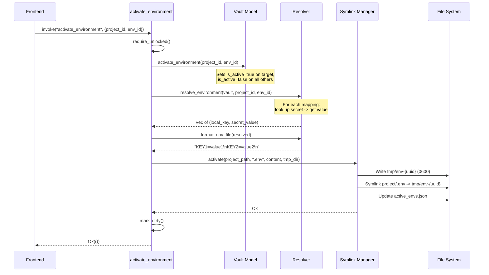
```mermaid
sequenceDiagram
    participant UI as Frontend
    participant CMD as activate_environment
    participant Vault as Vault Model
    participant Res as Resolver
    participant Sym as Symlink Manager
    participant FS as File System

    UI->>CMD: invoke("activate_environment", {project_id, env_id})
    CMD->>CMD: require_unlocked()
    CMD->>Vault: activate_environment(project_id, env_id)
    Note over Vault: Sets is_active=true on target,<br/>is_active=false on all others
    CMD->>Res: resolve_environment(vault, project_id, env_id)
    Note over Res: For each mapping:<br/>look up secret -> get value
    Res-->>CMD: Vec of (local_key, secret_value)
    CMD->>Res: format_env_file(resolved)
    Res-->>CMD: "KEY1=value1\nKEY2=value2\n"
    CMD->>Sym: activate(project_path, ".env", content, tmp_dir)
    Sym->>FS: Write tmp/env-{uuid} (0600)
    Sym->>FS: Symlink project/.env -> tmp/env-{uuid}
    Sym->>FS: Update active_envs.json
    Sym-->>CMD: Ok
    CMD->>CMD: mark_dirty()
    CMD-->>UI: Ok(())
```

### 6.2 Creating a Vault

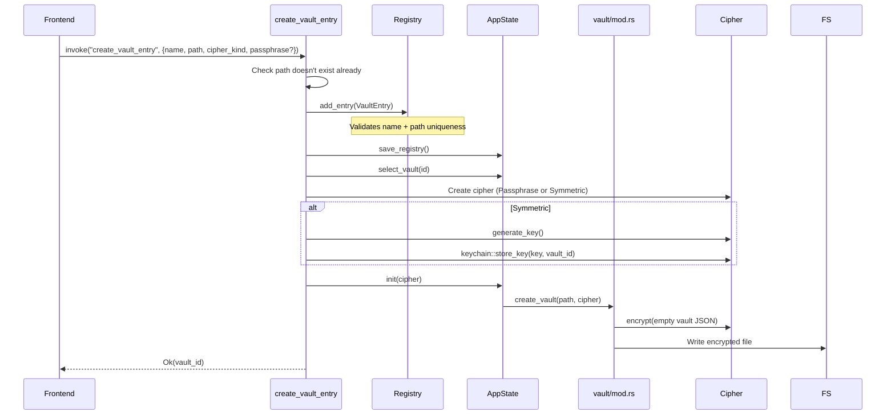
```mermaid
sequenceDiagram
    participant UI as Frontend
    participant CMD as create_vault_entry
    participant Reg as Registry
    participant State as AppState
    participant Vault as vault/mod.rs
    participant Crypto as Cipher

    UI->>CMD: invoke("create_vault_entry", {name, path, cipher_kind, passphrase?})
    CMD->>CMD: Check path doesn't exist already
    CMD->>Reg: add_entry(VaultEntry)
    Note over Reg: Validates name + path uniqueness
    CMD->>State: save_registry()
    CMD->>State: select_vault(id)
    CMD->>Crypto: Create cipher (Passphrase or Symmetric)
    alt Symmetric
        CMD->>Crypto: generate_key()
        CMD->>Crypto: keychain::store_key(key, vault_id)
    end
    CMD->>State: init(cipher)
    State->>Vault: create_vault(path, cipher)
    Vault->>Crypto: encrypt(empty vault JSON)
    Vault->>FS: Write encrypted file
    CMD-->>UI: Ok(vault_id)
```

### 6.3 Unlocking a Vault

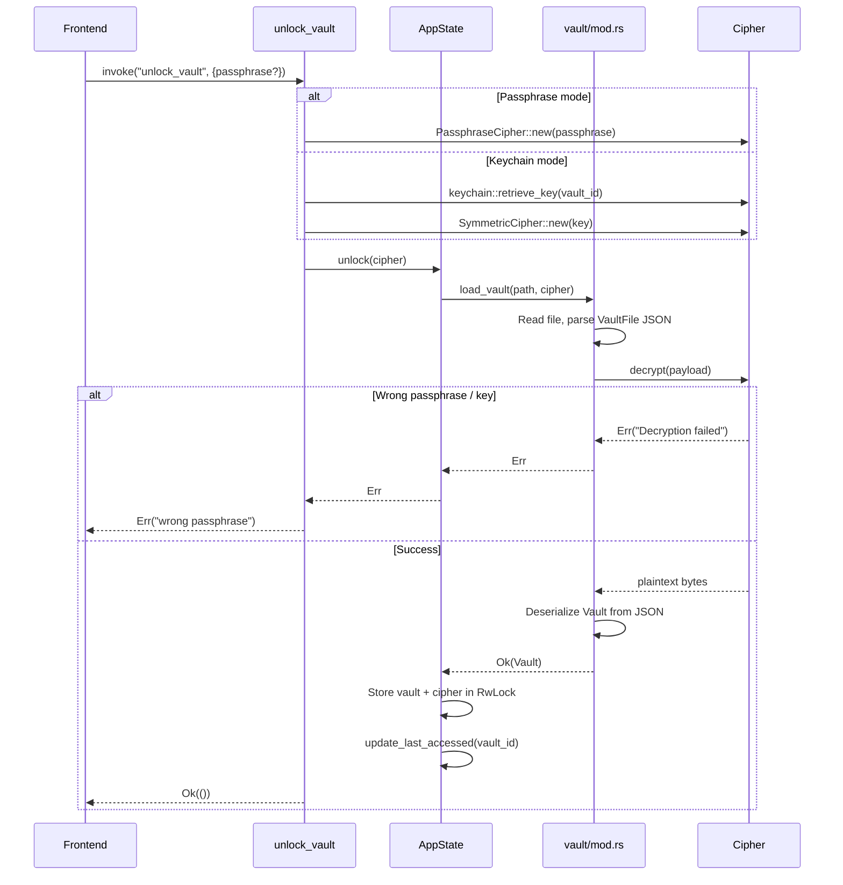
```mermaid
sequenceDiagram
    participant UI as Frontend
    participant CMD as unlock_vault
    participant State as AppState
    participant Vault as vault/mod.rs
    participant Crypto as Cipher

    UI->>CMD: invoke("unlock_vault", {passphrase?})
    alt Passphrase mode
        CMD->>Crypto: PassphraseCipher::new(passphrase)
    else Keychain mode
        CMD->>Crypto: keychain::retrieve_key(vault_id)
        CMD->>Crypto: SymmetricCipher::new(key)
    end
    CMD->>State: unlock(cipher)
    State->>Vault: load_vault(path, cipher)
    Vault->>Vault: Read file, parse VaultFile JSON
    Vault->>Crypto: decrypt(payload)
    alt Wrong passphrase / key
        Crypto-->>Vault: Err("Decryption failed")
        Vault-->>State: Err
        State-->>CMD: Err
        CMD-->>UI: Err("wrong passphrase")
    else Success
        Crypto-->>Vault: plaintext bytes
        Vault->>Vault: Deserialize Vault from JSON
        Vault-->>State: Ok(Vault)
        State->>State: Store vault + cipher in RwLock
        State->>State: update_last_accessed(vault_id)
        CMD-->>UI: Ok(())
    end
```

### 6.4 Updating a Secret (with symlink refresh)

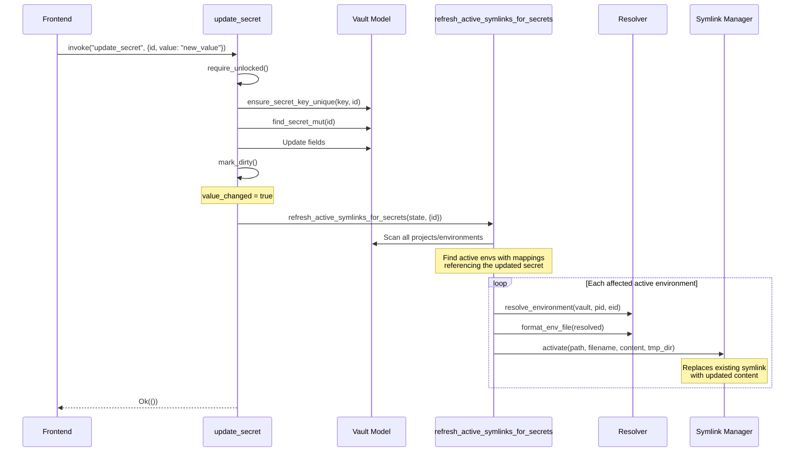
```mermaid
sequenceDiagram
    participant UI as Frontend
    participant CMD as update_secret
    participant Vault as Vault Model
    participant Refresh as refresh_active_symlinks_for_secrets
    participant Res as Resolver
    participant Sym as Symlink Manager

    UI->>CMD: invoke("update_secret", {id, value: "new_value"})
    CMD->>CMD: require_unlocked()
    CMD->>Vault: ensure_secret_key_unique(key, id)
    CMD->>Vault: find_secret_mut(id)
    CMD->>Vault: Update fields
    CMD->>CMD: mark_dirty()

    Note over CMD: value_changed = true
    CMD->>Refresh: refresh_active_symlinks_for_secrets(state, {id})
    Refresh->>Vault: Scan all projects/environments
    Note over Refresh: Find active envs with mappings<br/>referencing the updated secret
    loop Each affected active environment
        Refresh->>Res: resolve_environment(vault, pid, eid)
        Refresh->>Res: format_env_file(resolved)
        Refresh->>Sym: activate(path, filename, content, tmp_dir)
        Note over Sym: Replaces existing symlink<br/>with updated content
    end
    CMD-->>UI: Ok(())
```

### 6.5 Locking a Vault (app exit or manual)

```mermaid
sequenceDiagram
    participant Trigger as User / App Exit
    participant State as AppState
    participant Vault as Vault in memory
    participant Save as save_vault
    participant Sym as symlink::cleanup_all

    Trigger->>State: lock()
    State->>Vault: Set is_active=false on ALL environments
    State->>State: dirty = true
    State->>Save: flush_if_dirty()
    Save->>Save: Encrypt vault + atomic write
    State->>Sym: cleanup_all(tmp_dir)
    Sym->>Sym: Remove all temp files + symlinks
    Sym->>Sym: Empty manifest
    State->>State: vault = None (drop triggers zeroize)
    State->>State: cipher = None (drop triggers zeroize)
    State->>State: dirty = false
```

---

*This document was generated from codebase analysis as of March 2026.*
